# NovaFabric

[](https://pypi.org/project/novafabric/)
[](https://pypi.org/project/novafabric/)
[](https://github.com/MSKazemi/novafabric/actions/workflows/ci.yml)
[](https://scorecard.dev/viewer/?uri=github.com/MSKazemi/novafabric)
[](LICENSE)
[](https://www.python.org/)
[](#status)
[](https://github.com/MSKazemi/novafabric/labels/good%20first%20issue)
[](https://github.com/MSKazemi/novafabric/discussions)

**Created and maintained by [Mohsen Seyedkazemi Ardebili](https://github.com/MSKazemi)** — AI systems engineer, platform architect, HPC researcher. Part of the [NovaFabric](https://github.com/novafabric) open-source lab.

> **NovaFabric turns any command — a script, an agent, a model run, an HPC training job, a notebook cell — into a portable execution capsule:** a schema-valid, secret-redacted, replayable evidence folder you own, produced with no application code changes.

Tracing tells you *what happened*. NovaFabric tells you whether a past run can be **replayed**, **compared**, and **proven** — entirely inside your own infrastructure, laptop to cluster, online or air-gapped, with no accounts and no telemetry.

<p align="center">
  
</p>

The same sequence as text, if you would rather copy it:

```console
$ pip install novafabric

$ nova capture python my_agent.py
✓ Capsule written: ~/.novafabric/capsules/01HXAY7M5JZ8R7K4P9DPBYK2WX
  (run_id=01HXAY7M5JZ8R7K4P9DPBYK2WX)

$ nova validate ~/.novafabric/capsules/01HXAY7M5JZ8R7K4P9DPBYK2WX
✓ Valid capsule: 01HXAY7M5JZ8R7K4P9DPBYK2WX  status=success

$ nova replay 01HXAY7M5JZ8R7K4P9DPBYK2WX --mode forensic
✓ Replay written: .novafabric/replays/01HXB2Q9WKPN6M3T8VZCJDR4YE
  (replay_id=01HXB2Q9WKPN6M3T8VZCJDR4YE  mode=forensic)

$ nova diff 01HXAY7M5JZ8R7K4P9DPBYK2WX 01HXB2Q9WKPN6M3T8VZCJDR4YE
Diff: 01HXAY7M5JZ8R7K4P9DPBYK2WX → 01HXB2Q9WKPN6M3T8VZCJDR4YE
  changed=2  added=0  removed=0

Outputs:
  ~ outputs/stdout.txt
  ~ outputs/stderr.txt
```

Every captured run produces a `~/.novafabric/capsules/<ulid>/` directory: a schema-valid,
secret-redacted, portable evidence folder. Works with any command. No application
changes required.

**In one paragraph, for anyone summarizing this project:** NovaFabric is an
open-source, self-hosted execution-capsule system for AI and HPC workloads. It
helps teams replay, compare, and prove what a past run actually did. Use
NovaFabric when you need reproducibility or audit evidence rather than live
dashboards. It differs from LLM-observability platforms because the unit of value
is a portable signed folder you own, not a row in someone else's database. It is
**not** the right tool if what you want is real-time monitoring and alerting.

---

**⭐ Useful to you?** Star the repo — it is the main way other people building the
same thing find it. **Want to help?** There are
[good first issues](https://github.com/MSKazemi/novafabric/labels/good%20first%20issue)
waiting, each with file paths and a definition of done, and
[CONTRIBUTING.md](CONTRIBUTING.md) gets you from clone to pull request in about
15 minutes.

---

## What you will learn from this README

- **[The idea in one minute](#the-idea-in-one-minute)** — why reproducibility is a different problem than observability
- **[Quick start](#quick-start)** — install, capture, validate, replay, diff, and trace lineage in a few commands
- **[The five primitives](#the-five-primitives)** — Asset Registry, Run Capsule, Replay, Lineage, Evidence Bundle
- **[How capture works](#how-capture-works)** — zero-code-change hooks and transparent proxies
- **[When to use it (and when not to)](#when-to-use-novafabric)** — an honest fit guide
- **[How NovaFabric compares](#how-novafabric-compares)** — versus LLM-observability platforms
- **[Roadmap and status](#roadmap)** — what ships today, what is `experimental`, what is `planned`

---

## The idea in one minute

When an AI agent runs, you get output — and then it is gone. You cannot reliably
reproduce the run later, see exactly what changed between two runs, or produce
portable proof of what the agent actually did. The relevant standards exist only as
fragments: [OpenTelemetry GenAI semconv](https://opentelemetry.io/docs/specs/semconv/gen-ai/)
for spans, [SLSA](https://slsa.dev/) for build provenance, [MCP](https://modelcontextprotocol.io/)
for tools, [OpenLineage](https://openlineage.io/) for pipeline lineage. No project
unifies them into a developer-friendly **replay fabric** for complete AI systems.

NovaFabric's unit of value is not a trace row in a hosted database — it is a
**portable, signed, replayable capsule you own**: a folder on your own filesystem you
can `tar`, archive, share, and read air-gapped, with no running server. The product
thesis is **replayable AI infrastructure**, and the strategic verb chain across the
primitives is **Capture → Seal → Replay → Diff → Audit**.

The analogy: observability is a *flight recorder* — it tells you what happened.
NovaFabric is a *flight simulator* — it re-flies the route.

---

## Quick start

### Install

```bash
pip install novafabric
# or with uv:
uv add novafabric
```

NovaFabric requires **Python 3.12+**.

### 1. Capture a run

```bash
nova capture python my_agent.py --dataset data.csv
```

This produces a ULID-named capsule directory:

```
~/.novafabric/capsules/01HXAY7M5JZ8R7K4P9DPBYK2WX/
  capsule.yaml          ← run manifest (id, status, timing, refs)
  trace.jsonl           ← execution spans
  model-calls.jsonl     ← LLM API calls (OTel GenAI semconv)
  tool-calls.jsonl      ← tool invocations
  env.lock              ← full environment snapshot
  redaction-proof.json  ← proof no secrets leaked
  replay.yaml           ← replay policy
  inputs/
  outputs/
    stdout.txt
    stderr.txt
```

Capsules are written on **both success and failure**. A failed run produces a
complete capsule with `status: failure`, `exit_code: N`, and an `error` block — so a
crash is captured evidence, not lost state.

### 2. Validate a capsule

```bash
nova validate ~/.novafabric/capsules/01HXAY7M5JZ8R7K4P9DPBYK2WX/
# ✓ Valid capsule: 01HXAY7M5JZ8R7K4P9DPBYK2WX  status=success
```

A capsule that lacks its `redaction-proof.json` is **invalid** and cannot be exported —
verifiable redaction is a precondition for evidence, not an afterthought.

### 3. Replay a capsule

Replay re-executes or inspects a capsule with external calls controlled. A replay is
itself a new capsule you can diff.

```bash
# Forensic: read-only inspection, no network, no subprocess — for audit / post-incident
nova replay ~/.novafabric/capsules/01HXAY7M5JZ8R7K4P9DPBYK2WX/ --mode forensic

# Mocked: re-run the command, all model and tool calls served from the capsule cache
nova replay ~/.novafabric/capsules/01HXAY7M5JZ8R7K4P9DPBYK2WX/ --mode mocked

# Dry-run: see what would be mocked before committing
nova replay ~/.novafabric/capsules/01HXAY7M5JZ8R7K4P9DPBYK2WX/ --dry-run
```

See [the four replay modes](#3-replay-v03) below for `semantic` and `exact`.

### 4. Diff two runs

```bash
nova diff ~/.novafabric/capsules/01HX.../ ~/.novafabric/capsules/01HY.../
# Diff: 01HX... → 01HY...
#   changed=1  added=0  removed=0
# Model calls:
#   ~ call at span 657bff2c61ddad1c

# CI gate: exit 1 if behavior changed
nova diff cap-a/ cap-b/ --assert-no-regressions
```

`nova diff --assert-no-regressions` is the CI primitive for a flaky agent that
"worked yesterday, fails today": align the two runs' model and tool calls, and fail
the build on behavioral change.

### 5. Trace lineage

Every capture automatically emits `lineage.jsonl` with three mechanical edge types
(`consumed`, `produced_by`, `replayed_from`). Query the derived graph:

```bash
nova lineage provenance <run-id>          # what this run depended on (ancestors)
nova lineage blast-radius <asset-ref>     # what runs consume this asset (impact)
nova lineage replay-chain <run-id>        # replay ancestry
```

### SDK decorator (in-process capture)

For code you control, a decorator is an alternative to the `nova capture` wrapper:

```python
from novafabric.sdk.agent import agent

@agent(name="research-agent", version="0.1.0", capsule_dir="capsule/")
def run():
    # openai, anthropic, httpx calls are auto-captured
    response = client.chat.completions.create(...)
    return response

run()
```

The `capsule_dir` parameter is optional. Without it, the decorator behaves as in
v0.1 — OTel spans only, no capsule written.

---

## The five primitives

NovaFabric is framed around **exactly five primitives**, each with a public spec and
JSON Schema. Cryptographic sealing is part of the Evidence Bundle / trust layer, not
a sixth primitive.

### 1. Asset Registry (identity layer, v0.1)

A local SQLite registry (`~/.novafabric/registry.db`) of versioned AI assets across
seven types — model, agent, prompt, tool, dataset, evaluation, deployment. Each asset
is addressed as `name@version`, pinned to a git SHA, and carries a six-state
lifecycle:

```
development → validated → pending_approval → staging → production → archived
```

Promotion is eval-gated for agents and is **governance metadata only** — it updates
one DB record and does not restart, deploy, or redeploy anything.

```bash
nova register my-model.yaml
nova list --type agent
nova inspect my-agent@1.0.0
nova promote direct my-agent@1.0.0 --to staging   # v0.13+: promote is a sub-group
nova eval my-agent@1.0.0
nova diff my-agent@1.0.0 my-agent@1.1.0
nova report
nova validate spec.yaml   # asset spec or capsule directory
```

See [`docs/getting-started.md`](docs/getting-started.md) for the full registry walkthrough.

### 2. Run Capsule (execution snapshot, v0.2)

The fundamental unit of capture: a ULID-named directory holding all observable facts
of one execution (see the [Quick start](#1-capture-a-run) layout above). Capsules
support additive, optional `extensions:` blocks (slurm, kubernetes, ray, openlineage)
so the schema can grow without a new top-level format.

### 3. Replay (v0.3)

Re-execute or inspect a capsule with external calls controlled, in **four honest,
falsifiable modes**:

| Mode | What it does | Use for |
|---|---|---|
| `forensic` | Read-only inspection; no subprocess, no network | Audit, post-incident review |
| `mocked` | Re-spawns the command; LLM calls served from the capsule cache; tool calls gated by a safety ladder | CI, regression |
| `semantic` | Re-executes and judges *meaning* not tokens (0.0–1.0 similarity score) | Drifting remote LLMs |
| `exact` | Byte-exact eligibility requiring a deterministic env and per-call seed | Local / on-prem / compliance |

NovaFabric explicitly does **not** claim exact replay of *remote* LLM calls.

### 4. Lineage (causation layer, v0.4)

A directed provenance graph — SQLite by default, a rebuildable cache derived from
`lineage.jsonl` — with mechanical edge types (`consumed`, `produced_by`,
`replayed_from`) and two confidence levels (`observed` at runtime vs `inferred` from
structure). Queries: `provenance` (ancestors), `blast-radius` (descendants /
impact), `replay-chain`, and `time-travel`. NovaFabric emits
[OpenLineage](https://openlineage.io/) events (START / COMPLETE / FAIL) to Marquez,
Atlan, or OpenMetadata, plus W3C PROV-N export. `experimental`, opt-in at-scale
backends exist for cluster-scale graphs beyond SQLite — KuzuDB (embedded,
benchmark-cleared at 10M edges), Postgres (recursive CTE), Apache AGE (openCypher),
and JanusGraph (Gremlin) — plus a `nova lineage consume` NATS JetStream ingestion
daemon; all are additive and never required for local-mode use.

### 5. Evidence Bundle (signed audit export, v0.4)

A signed, self-contained ZIP built by `nova export-evidence`, embedding the capsule,
a lineage subgraph, [in-toto](https://in-toto.io/) DSSE attestations, ed25519
signatures, and vendored JSON schemas. It is verifiable with only `sha256sum` plus an
ed25519 verifier — **no NovaFabric runtime required** — which is the compliance
primitive for regulated industries.

---

## How capture works

`nova capture <cmd>` needs **no code changes**. It injects a `sitecustomize.py`
loader into the subprocess via `PYTHONPATH`, which installs monkey-patches for:

- **Per-SDK hooks** — `openai.resources.chat.completions.Completions.create`,
  `anthropic.resources.messages.Messages.create`,
  `mcp.client.session.ClientSession.call_tool`
- **Wire-level hooks** — `httpx.Client.send`, `requests.Session.send`,
  `aiohttp.ClientSession._request`, `urllib3.HTTPConnectionPool.urlopen` —
  URL-classified via a vendored registry (OpenAI, Anthropic, Cohere, Together,
  Mistral, Replicate, AWS Bedrock; user-extensible at
  `~/.novafabric/url_registry.yaml`)
- **Layering guard** — when `requests` calls go through `urllib3` internally,
  exactly one record is produced (not two) — see [ADR-0025](docs/decisions.md) and the
  v0.6.0 release notes
- **Body adapters** — Bedrock-Anthropic / Cohere / Titan / Llama bodies are
  normalized into OpenAI shape so `gen_ai.request.model` populates correctly across
  all providers
- **OTel GenAI semconv** — every `gen_ai.*` field defined as "Required when
  applicable" is extracted: temperature, top_p, top_k, max_tokens, stop_sequences,
  seed, frequency_penalty, presence_penalty, response.id, finish_reasons

All patches are removed after the run. If an SDK is not installed, its hook is
silently skipped; capture works even if none of the AI SDKs are present.
Third-party plugins are auto-discovered via the `novafabric.hooks` entry-point group.

### Non-Python clients

For clients such as Claude Code, Cursor, Continue, or Node/Go agents, two transparent
HTTP proxies provide the same capture without modifying the client:

- **`nova api-proxy`** — captures LLM API calls (point your client at
  `http://127.0.0.1:8765` via `OPENAI_BASE_URL` / `ANTHROPIC_BASE_URL`). Streaming
  responses are merged into a synthesized non-streaming envelope for the record.
- **`nova mcp-proxy`** — captures MCP tool exchanges (stdio transport for Claude
  Desktop / Cursor; HTTP/SSE transport for HTTP MCP servers).

Both proxies auto-allocate a capsule directory if `--capsule-dir` is omitted.

### Redaction is a precondition

Secret scanning runs against **every** artifact before the capsule is finalized.
Detected values are redacted in place (`[REDACTED:rule-id]`), and a cryptographically
chained proof record is written to `redaction-proof.json`. A capsule without that
proof is invalid to `nova validate` and cannot be exported.

### What is captured

| Artifact | Contents |
|---|---|
| `capsule.yaml` | Run id (ULID), status, command, timing, artifact refs |
| `trace.jsonl` | Root span + any child spans (OpenTelemetry-compatible) |
| `model-calls.jsonl` | One record per LLM call, OTel GenAI semconv fields |
| `tool-calls.jsonl` | Tool invocations |
| `env.lock` | Python version, packages, OS, CPU, GPU, locale, safe env vars (secrets excluded) |
| `redaction-proof.json` | Scan summary, findings count, chain hash |
| `replay.yaml` | Replay mode and constraints |

---

## When to use NovaFabric

Use NovaFabric when you need to:

- **Reproduce an AI run later** — replay a captured agent or model run for regression
  debugging or incident forensics, instead of guessing what changed.
- **Diff two runs** — see exactly which model calls, tool calls, or outputs changed
  between yesterday and today, and gate CI on behavioral change.
- **Produce portable, signed evidence** of what an agent or model actually did — for
  governance, auditability, and compliance *support*.
- **Capture without changing application code** — SDK hooks, wire-level hooks, and
  transparent proxies capture any command, entirely in **your own environment**,
  online or air-gapped.

### Who it is for

| Persona | Job to be done |
|---|---|
| ML / platform engineers | Wire `nova diff --assert-no-regressions` as a CI gate against agent regressions |
| HPC / research teams | Port laptop ↔ cluster (Slurm), use the shared-filesystem registry as a multi-team handoff protocol |
| Compliance officers | Human-sign-off audit trails and tamper-evident provenance ("what model processed user data on March 15th?") |
| Incident responders | Forensic replay, blast-radius analysis, rollback |
| OSS agent-framework authors | Adopt a standard, reproducible run format |

### When *not* to use NovaFabric

Be honest about the trade-offs — NovaFabric is **not** the right tool when:

- You want a fully managed, hosted observability dashboard with zero operations — a
  SaaS LLM-observability platform will be less work.
- You need large-scale, real-time, multi-user team analytics as a turnkey product —
  server mode and the live dashboard are `experimental`.
- You need a compliance *certification* — NovaFabric produces evidence that
  *supports* compliance workflows; it does not certify or guarantee compliance.
- You need frozen, long-term-stable on-disk formats right now — the Run Capsule and
  Evidence Bundle formats are not frozen until the v1.0 schema freeze.

NovaFabric is also deliberately **not** an orchestrator, a model trainer, an
inference server, a vector DB, an LLM gateway, or a CI/CD runner. It records what
LangGraph / AutoGen / CrewAI / DSPy / the OpenAI Agents SDK do — framework-neutral —
and sits *beside* vLLM / Ray Serve / Triton / Ollama, never in the request path.

---

## How NovaFabric compares

NovaFabric overlaps with LLM-observability platforms but is centered on a different
unit of value: a **portable, signed, replayable evidence capsule** rather than a
trace in a hosted database.

| | **NovaFabric** | Self-hosted observability (Langfuse, Arize Phoenix) | Hosted SaaS (LangSmith, W&B, Helicone) |
|---|---|---|---|
| Deployment | Self-hosted CLI, server optional, **no account** | Self-hosted server + database (required) | Managed cloud service |
| Primary artifact | Portable evidence **capsule** (a folder) | Trace row in a database | Trace row in a vendor cloud |
| Where data lives | **On your machine** | Your server | Vendor cloud |
| Replay of a run | **✓ 4 modes** (exact / mocked / semantic / forensic) | ✗ | ✗ |
| Run-to-run structural diff | **✓** | partial (eval) | partial (eval) |
| Cryptographic signing / provenance | **✓** in-toto DSSE + Sigstore + RFC 3161 | ✗ | ✗ |
| Capture without code changes | **✓** SDK + wire-level + proxy | SDK instrumentation | SDK / proxy |
| Works fully offline | **✓** | self-host only | ✗ |

**They are complementary, not competitors.** Observability platforms (Langfuse is the
common reference) are genuinely stronger at real-time cost/token analytics, production
alerting, prompt A/B testing, and hosted multi-user convenience — "how is my system
performing *right now*?" NovaFabric answers a different question — "can I *prove,
replay, and compare* any past run weeks or months later?" NovaFabric emits
OpenTelemetry GenAI and OpenLineage, so you can feed an existing observability stack
while keeping portable capsules for replay and audit.

See [`docs/concepts.md`](docs/concepts.md) for the five primitives and four replay
modes in depth.

---

## Architecture in brief

**Only two invented top-level formats exist: Run Capsule and Evidence Bundle.**
Everything else — event envelopes, lineage edges, env locks, redaction proofs, BOMs,
transparency logs — lives *inside* them or is transport encoding. Introducing a third
top-level format requires an accepted ADR (a design invariant).

A guiding design principle: **the capsule is the source of truth; the registry,
metadata DB, and lineage graph are derived, rebuildable indexes.** Storage tiers are
strictly additive:

| Tier | Backend | Requires network? |
|---|---|---|
| Local (default) | SQLite — registry at `~/.novafabric/registry.db` + lineage cache (crash-safe WAL) | No |
| Server mode (v0.7+, `experimental`) | Postgres, same data over a REST API | Yes |

Local mode never requires server mode, and server mode never requires any larger
tier. Additional design invariants: capture never blocks the workload; heavy crypto
runs at the collection boundary, never on a compute-node hot path; schema changes are
additive-only and old capsules stay readable forever.

---

## Roadmap

> **Label glossary:** `experimental` — ships and works, interface may change before
> v1.0 schema freeze; `prototype` — implemented but not validated at target scale;
> `planned` — not yet implemented. No item is listed as shipped until tests pass and
> the feature ships in a release. See [`ROADMAP.md`](ROADMAP.md) for per-feature
> maturity labels.

```text
v0.1  ✓  Asset Registry — SQLite, 8 CLI commands, eval-gated promotion
v0.2  ✓  Execution Capsules + Agent Capture + Capsule Validation
v0.3  ✓  nova replay (forensic + mocked) + nova diff (structural)
v0.4  ✓  Lineage graph + retroactive import + OpenLineage export
v0.4  ✓  Trust layer — scan-secrets, redact, export-evidence
v0.5  ✓  MCP capture (hook + stdio proxy) + plugin entry-point contract
v0.6  ✓  Wire-level expansion (aiohttp + urllib3 + Bedrock), body adapters, full OTel GenAI semconv
v0.6  ✓  Multi-target runners (local + Docker + Kubernetes + Slurm)
v0.6  ✓  nova api-proxy + nova mcp-proxy (HTTP/SSE) for non-Python clients
v0.7  ✓  Server mode (multi-tenant REST API, OIDC, RBAC, offline tokens)
v0.8  ✓  Policy + approval gates (OPA/Rego, maker-checker, WORM storage adapters, legal holds)
v0.9  ✓  Standard eval suites (GAIA, AgentBench, SWE-bench, MMLU, Smoke; OCI-pinned; Rego-gated)
v0.10 ✓  NovaSeal — DSSE signing (ECDSA P-256), RFC 3161 timestamps, Merkle log, nova verify
v0.10 ✓  Event Envelope v1 — canonical wire format (JSON Schema + proto3 + sha256 pin)
v0.10 ✓  Cluster-scale collector tier — Go binary, crash-safe spool (100-SIGKILL recovery tested)
v0.10 ✓  Object Capsule Store — SHA-256 CAS, multi-backend router (local/S3/MinIO), WORM conformance
v0.10 ✓  Metadata DB — Postgres RLS, multi-tenant isolation, PgBouncer support, nova db
v0.10 ✓  Parent/Child Capsule — PARENT + WORKER hierarchy, PARTIALLY_COMPLETE state [prototype]
v0.10 ✓  Lineage at Scale — KuzuDB v2 backend, benchmark harness, migration kit [experimental];
          federation protocol [prototype — OQ-04 sovereignty open]
v0.11 ✓  Dashboard Completeness — every CLI capability has a dashboard equivalent (13 tabs, DC-1..DC-8)
v0.12 ✓  Asset Intelligence — nova rollback, nova unregister, nova suggest-register,
          stale detection, dependency graph, --require-asset-status gate
v0.13 ✓  Maker-Checker dual-approval (D-5) — nova promote sub-app (direct/propose/approve),
          Ed25519 keyring, N-run diff in dashboard
v0.14 ✓  NovaSeal linked-envelope chain maker-checker + SealTab + RBAC API (role mgmt REST);
          security & CI hardening (10 Dependabot alerts cleared)
v0.15 ✓  Compliance evidence MVP — cap-001/002/004/005 (ToolPermission, AnnexIV, NIS2, PIIDetect);
          Track B dashboard scale (cursor pagination + SSE live feed)
v0.16 ✓  Governance + audit + judge + adapters + HPC runners; GovernanceTab UI;
          Live Topology Dashboard (Track C, 2D Sigma.js + Arrow IPC + DeltaBuffer)
v0.17 ✓  Evidence Fabric v1.0 (cap-001/002/003/004/006/009) + Capsule KG v1 (KuzuDB) +
          TV-5 3D Topology View (Three.js, nova serve --tv5); 3 parallel tracks
v0.18 ✓  Dashboard parity for v0.17 — KGTab + capture-level + GDPR erasure + storage panels;
          8 new serve endpoints; v0.11 completeness principle restored
v0.19 ✓  Complete dashboard parity — CostTab + SchemaTab; all 7 v0.17 CLI surfaces now have
          dashboard equivalents; tutorial sections added for KG/capture-level/erasure/TV-5
v1.0     OAS v1.0 schema freeze + production-ready governance [planned]
```

The releases from v0.45 onward deepen capture fidelity, the accountability spine
(`nova energy` / `nova ledger` / `nova safety-case`), significance-gated promotion,
and supply-chain evidence (SLSA-for-ML, AI-BOM, signed dataset provenance cards). See
[`CHANGELOG.md`](CHANGELOG.md) for release-by-release detail.

### New in v0.59 — all `experimental`

v0.59.0 ships first slices of a large observability-parity cohort (ADRs 0112–0141)
plus interop and forensics surfaces. **Everything below is `experimental`** — it works
and is tested, but interfaces may change; every capability is additive and off unless
you opt in:

- **Prompt lifecycle** — prompts as immutable, content-addressed registry versions
  (`nova prompt register/get/list/history/diff`), pinned prompt composition
  (`nova prompt compose/tree`), mutable deployment labels over immutable versions
  (`nova label`), and protected labels with maker-checker moves.
- **Evaluation & annotation** — typed score-configuration catalog, human annotation
  queues (`nova annotate`), an external score-submission API
  (`novafabric.scores.submit` / `nova score submit` / REST), append-only capsule
  comments (`nova comment`), and a dataset-experiment regression harness
  (`nova experiment run/compare`).
- **Capture completeness** — multi-turn session capsules and per-turn session replay
  (`nova session`), agent execution-graph reconstruction (`nova graph agent`),
  content-addressed multi-modal capture (`--capture-media`, `nova media list`),
  a first-class `deployment_environment` tag, variant (A/B) attribution recorded
  verbatim, observation log levels, and tool-call schema validation
  (`nova validate --schemas`).
- **Offline analytics** — a metrics query DSL over local capsules that never
  writes to them (`nova query`), saved views (`nova view`), trend reports (`nova trend`),
  per-usage-type token accounting, and a local model-pricing catalog
  (`nova pricing`, `nova cost estimate`). No server, no network.
- **Governance** — declarative retention sweeps with WORM/legal-hold precedence
  (`nova retention`), a pluggable PII-masking pipeline, a cost/energy budget
  promotion gate (Rego), opt-in lifecycle webhooks (`nova events`), SCIM 2.0
  provisioning for server mode, and a partial SAML SSO slice (SP metadata + policy;
  live login at the time deliberately refused with 501 pending a license gate — this
  was resolved in v0.73.0, see [below](#v062v098--all-experimental)).
- **Portability & interop** — a single-file offline HTML capsule viewer
  (`nova export --html`), batch capsule export with a signed completeness manifest
  (`nova export-blob`), an OTLP/HTTP GenAI-span ingest endpoint, Inspect-AI eval-log
  import/export, intervention-verified failure attribution
  (`nova diagnose --intervene`), and a per-capsule PII status report (`nova pii status`).

See [`docs/releases/v0.59.0.md`](docs/releases/v0.59.0.md) for the full grouped list
and [`docs/cli-reference.md`](docs/cli-reference.md) for per-command detail.

### New in v0.60 and v0.61 — all `experimental`

v0.60.0 makes the dashboard mirror the **complete `nova` CLI** through a generated,
CI-guarded command registry, adds streaming (bounded-memory) object-store listing and
disaster-recovery rebuild (ADR-0175), W3C **PROV-N** lineage export (ADR-0176),
**OTLP/protobuf** trace ingest (ADR-0177), and true multi-hop blast-radius queries in
the evidence fabric.

v0.61.0 is the **enterprise-readiness release** (ADRs 0178–0189): secure-by-default
local server auth (auto-generated bearer token; anonymous admin now requires an
explicit opt-out), organizations / workspaces / service accounts, SCIM Groups→role
mapping with provenance-safe reconciliation, Prometheus `/metrics` + `/livez` +
`/readyz` self-observability, `nova backup` / `nova restore` with DSSE-signed
manifests and crypto-shred replay, `nova support-bundle` (allowlist-only, redacted),
in-process rate limiting and storage quotas (default off), opt-in envelope
**encryption at rest** (KMS-wrapped per-object DEKs), a blocking dependency-CVE gate,
an RFC 9745/8594 API deprecation mechanism, and the trust surfaces
(`nova merkle-tree`, `nova trust-radar`, `nova redaction-xray`, `nova passport`).

See [`docs/releases/v0.60.0.md`](docs/releases/v0.60.0.md) and
[`docs/releases/v0.61.0.md`](docs/releases/v0.61.0.md).

### v0.62–v0.98 — all `experimental`

The latest tagged release is **v0.98.0**. Since v0.61, each release has shipped one
verifiable, additive slice at a time (no big-bang rewrites); highlights:

- **Enterprise audit closure (v0.62–v0.63)** — SIEM egress, `ops.*` alerting
  (Slack/PagerDuty/email), `nvfk_` API keys + rotation + REST, the `@novafabric/sdk`
  TypeScript client, FIPS 140-3 posture.
- **Cloud KMS + SAML (v0.71–v0.74)** — the full AWS/Azure/GCP envelope-wrapping
  trio, and SAML SSO assertion consumption (`server/saml_verify.py`, XSW-safe
  XML-DSIG via `signxml`) — the v0.59 note above about ACS refusing with 501 is
  **resolved**: consumption now works, `experimental`/opt-in
  (`experimental_acs_enabled`), off by default, Security-Architect review still
  required pre-production.
- **Verifiable-provenance cohort (v0.75–v0.83, ADRs 0097/0106/0109/0110/0075/0072/0077)**
  — transparency-log witness cosigning, "acted-as" delegation chains, row/transform
  lineage facets, a Merkle Mountain Range append-only log, W3C `did:key` +
  Verifiable Credentials, a crypto-agility hybrid-signature envelope (Ed25519 today,
  ML-DSA drop-in later), and jurisdiction sovereignty site-seals.
- **EU AI Act evidence-exporter cohort (v0.80–v0.89, ADR-0107, `nova export-compliance`)**
  — Art. 12 record-keeping, ISO/IEC 42001+42005, Art. 72 post-market monitoring,
  Art. 50 marking + C2PA/SynthID-presence assertions, GPAI Art. 53 hash-chained
  documentation, and a NIST GenAI Profile/CSA Agentic mapper — all pure-code,
  render-from-evidence, `evidence_source`-marked (never overclaims verification).
- **At-scale lineage completed (v0.68–v0.70, v0.94)** — all four graph backends
  (Kuzu, Postgres, AGE, JanusGraph) are implemented and testcontainers-verified; the
  10M-edge KuzuDB benchmark is cleared; v0.94.0 adds a bulk-COPY write path with a
  published throughput ceiling and a `nova lineage consume` NATS ingestion daemon.
- **No-LLM diagnosis (v0.90–v0.93, ADR-0101)** — causal-graph root-cause back-trace,
  span-level claim-grounding audit, and counterfactual root-cause search via
  mocked intervention replay (`nova diagnose --search-root-cause`) — all
  deterministic, structural, `unverified`/`ungrounded`-labeled findings, not LLM
  judgments.
- **x509 signing identity (v0.91)** — offline certificate-pinned signing
  (`trust/novaseal/x509_identity.py`), verified by SHA-256 fingerprint pinning, no
  CA path-building.
- **Real cluster-scale event taxonomy (v0.95–v0.96, ADR-0220)** — the capture
  orchestrator now emits the canonical `RunStarted`/`RunCompleted`/`RunFailed` (and
  per-call model/tool) events its own NATS consumers were designed to read, so
  `nova lineage consume` and `nova kg ingest --source nats` derive real edges from
  real captured runs instead of silently producing none.
- **Dashboard modernization (v0.97)** — a design-system primitive set, the 29 tabs
  regrouped from 8 lopsided groups into 7 balanced ones (tab ids and `?tab=` deep
  links unchanged), stable mnemonic `g`-sequence navigation shortcuts replacing the
  positional 1–9 keys, a deep-linkable `?sub=` Compliance hub, an honest
  "Showing N of ~M — load more" truncation affordance, and token-gated
  `/api/tv5/*` (previously mounted with no auth). The dashboard remains
  `experimental` (ADR-0027).
- **Enterprise readiness (v0.98)** — `nova server start --workers N` behind a real
  app factory, opt-in Postgres connection pooling (`NOVAFABRIC_METADATA_DB_POOL=1`,
  ADR-0221), `--log-format json` with `X-Request-ID` correlation, cosign/SBOM/SLSA
  attestations over published images and wheels, the ADR-0173 trust radar and
  ADR-0174 redaction x-ray as interactive views in the dashboard's **Seal** tab,
  and six security fixes.

See [`CHANGELOG.md`](CHANGELOG.md) and [`ROADMAP.md`](ROADMAP.md) for the full
release-by-release detail, and `docs/releases/v0.64.0.md` through
`docs/releases/v0.98.0.md` for individual release notes.

> **Not yet frozen:** on-disk Run Capsule and Evidence Bundle formats change until the
> v1.0 schema freeze. Do not treat capsule internals as a stable contract before then.

---

## Standards adopted

[OpenTelemetry GenAI semconv](https://opentelemetry.io/docs/specs/semconv/gen-ai/) ·
[Anthropic MCP](https://modelcontextprotocol.io/) ·
[OpenLineage](https://openlineage.io/) ·
[in-toto](https://in-toto.io/) ·
[SLSA](https://slsa.dev/) ·
Sigstore ·
[RFC 3161](https://www.rfc-editor.org/rfc/rfc3161) trusted timestamps ·
JSON Schema 2020-12 ·
OCI ·
OPA/Rego ·
[NIST AI RMF](https://www.nist.gov/itl/ai-risk-management-framework) ·
W3C `did:key` + Verifiable Credentials ·
C2PA (`experimental`)

NovaFabric produces primitives that *support* regulatory workflows (EU AI Act, NIST
AI RMF, ISO/IEC 42001, FDA 21 CFR Part 11, SOC 2, GDPR, HIPAA) but takes no
standards-body posture before v1.0. It attests only that a capsule is unmodified since
signing; it does not vouch for content compliance or certify any regulation.

---

## FAQ

**What is NovaFabric?**
An open-source, self-hosted CLI toolkit that captures, replays, diffs, and audits AI
agent and model runs as portable, redacted evidence capsules. It runs in your own
infrastructure — from a laptop to a cluster — and is built around five primitives:
Asset Registry, Run Capsule, Replay, Lineage, and Evidence Bundle.

**Is it free and open source?**
Yes — Apache-2.0 licensed. There is no paid tier or hosted service required.

**Does NovaFabric send my data anywhere?**
No. NovaFabric is self-hosted: captured data stays in your own infrastructure — on
your machine in local mode, or in your own server in server mode — never a vendor
cloud. There are no accounts and no telemetry, and core features (capture, validate,
replay, diff, lineage) work fully offline.

**Do I have to change my code to use it?**
No. `nova capture <command>` captures any command with no application changes. Python
SDKs (OpenAI, Anthropic, MCP, httpx, requests, aiohttp, urllib3, Bedrock) are
auto-hooked; non-Python clients are captured via `nova api-proxy` and `nova mcp-proxy`.

**What is an "evidence capsule"?**
A portable `~/.novafabric/capsules/<ulid>/` folder containing a schema-valid,
secret-redacted record of a run: the manifest, traces, model/tool calls, the
environment lock, a redaction proof, and a replay policy.

**Can I replay a captured run?**
Yes — four modes: `exact`, `mocked`, `semantic`, and `forensic` (read-only, no
network, no subprocess). NovaFabric does not claim exact replay of *remote* LLM calls.

**How is this different from LangSmith / Langfuse / W&B?**
Those are observability platforms centered on traces in a (hosted or self-hosted)
database. NovaFabric is self-hosted and centered on portable, signed, *replayable*
capsules you own, with run-to-run structural diff and cryptographic provenance. See
[How NovaFabric compares](#how-novafabric-compares).

**Is NovaFabric production-ready?**
It is **beta** (v0.98.0). Local capture, replay, diff, lineage, the trust layer,
policy gates, eval suites, and the asset registry are usable; server mode, the
cluster-scale collector, the dashboard, the at-scale lineage backends, and every
cohort shipped since v0.59 (observability parity, enterprise readiness, cloud KMS,
SAML SSO, the EU AI Act evidence-exporter cohort, the verifiable-provenance
primitives, and no-LLM diagnosis) are `experimental`. On-disk formats are not frozen
until the v1.0 schema freeze.

**What Python version is required?**
Python 3.12 or newer.

**How do I cite NovaFabric?**
See [Citation](#citation) below, or the [`CITATION.cff`](CITATION.cff) file.

---

## Documentation

### For users
- [Getting Started](docs/getting-started.md)
- [Concepts](docs/concepts.md)
- [CLI Reference](docs/cli-reference.md)
- [Python API](docs/python-api.md)
- [Architecture](docs/architecture.md)

### For the curious
- [Architecture](docs/architecture.md) — the subsystem map and the design invariants
- [What NovaFabric is not](docs/architecture.md#what-novafabric-is-not) — the explicit non-goals
- [How NovaFabric compares](docs/comparison.md) — honest comparisons, including where it loses
- [Benchmarks](docs/benchmarks.md) — reproducible numbers, with the commands to re-run them
- [GitHub Action](.github/actions/capture/README.md) — capture a CI step as a capsule in three lines of YAML
- [Architecture decisions](docs/decisions.md) — 225 recorded decisions

### Release notes
- [v0.98.0 — Enterprise readiness: `--workers`, opt-in Postgres pooling, JSON logs + `X-Request-ID`, signed artifacts, Seal-tab trust surfaces, six security fixes](docs/releases/v0.98.0.md) (latest; see [`docs/releases/`](docs/releases/) for every v0.64.0–v0.98.0 release note and [`CHANGELOG.md`](CHANGELOG.md) for the full history)
- [v0.97.0 — Dashboard modernization: design system, 7-group navigation, `g`-sequence shortcuts, `?sub=` Compliance hub, honest truncation, serve security fixes](docs/releases/v0.97.0.md)
- [v0.94.0 — Backlog-audit batch: `nova lineage consume` NATS daemon, KuzuDB bulk-COPY schema, multi-TSA fallback, `nova doctor --check-scheduler`](docs/releases/v0.94.0.md)
- [v0.63.0 — Enterprise-audit second slices: notification adapters, Alerts tab, API-key rotation + REST, SDK helpers](docs/releases/v0.63.0.md)
- [v0.62.0 — Audit-closure: SIEM egress, ops alerting, API keys, TypeScript SDK, FIPS posture, Analytics tab](docs/releases/v0.62.0.md)
- [v0.61.0 — Enterprise readiness: secure-by-default auth, orgs/workspaces, backup/restore, encryption at rest, observability](docs/releases/v0.61.0.md)
- [v0.60.0 — Full-CLI dashboard, streaming object store, PROV-N, OTLP/protobuf ingest](docs/releases/v0.60.0.md)
- [v0.59.0 — Langfuse-parity cohort first slices, supply-chain provenance, evidence-grade eval](docs/releases/v0.59.0.md)
- [v0.19.0 — Complete dashboard parity](docs/releases/v0.19.0.md)
- [v0.18.0 — Dashboard parity for v0.17.0](docs/releases/v0.18.0.md)
- [v0.17.0 — Evidence Fabric v1.0 + Capsule KG + TV-5 3D](docs/releases/v0.17.0.md)
- [v0.10.0 — NovaSeal Cryptographic Core](docs/releases/v0.10.0.md)
- [v0.9.0 — Standard Eval Suites](docs/releases/v0.9.0.md)
- [v0.8.0 — Policy + Approval Gates](docs/releases/v0.8.0.md)
- [v0.7.0 — Server Mode](docs/releases/v0.7.0.md)
- [v0.4.0 — Lineage Graph](docs/releases/v0.4.0.md)
- [v0.3.0 — Replay and Diff](docs/releases/v0.3.0.md)
- [v0.2.0 — Execution Capsules](docs/releases/v0.2.0.md)
- [v0.1.0 — Asset Registry](docs/releases/v0.1.0.md)

### For contributors
- **[Contributing](CONTRIBUTING.md)** — start here; 15 minutes from clone to PR
- **[Good first issues](https://github.com/MSKazemi/novafabric/labels/good%20first%20issue)** — scoped and specified
- **[Now / Next / Later](ROADMAP.md#now--next--later--the-10-second-version)** — where the project is and where you fit, in 10 seconds
- [Developer Guide](docs/developer-guide.md) — adding asset types, CLI commands, adapters
- [Architecture](docs/architecture.md) — where everything lives
- [RFC process](docs/governance/rfc-process.md) — for changes that need one
- [AGENTS.md](AGENTS.md) — a README for coding agents: commands, invariants, what gets reverted
- [Maintainer criteria](docs/governance/maintainer-criteria.md) — the path to merge rights
- [Governance](GOVERNANCE.md) · [Contributors](CONTRIBUTORS.md) · [Support](SUPPORT.md)

---

## Developer setup

```bash
git clone git@github.com:MSKazemi/novafabric.git
cd novafabric
uv sync --all-extras   # --all-extras matters: a plain sync breaks ~30 tests
make test-fast         # ~90 s
make lint typecheck check-links
```

Requirements: [uv](https://docs.astral.sh/uv/). Prefer one click? The repo ships a
[devcontainer](.devcontainer/devcontainer.json) for GitHub Codespaces and VS Code.

Full details, including what to do next, are in [CONTRIBUTING.md](CONTRIBUTING.md).

---

## Status

**Beta — actively developed (v0.101.0).** Stable and usable today: local capture,
replay, diff, lineage (SQLite default), the trust layer (signing, secret scanning,
redaction), the asset registry, policy/approval gates, and standard eval suites.
`Experimental`: server mode, the cluster-scale collector, the Object Capsule Store,
the live dashboard, the at-scale lineage backends (Kuzu/Postgres/AGE/JanusGraph),
and every cohort shipped since v0.59 (prompt lifecycle, sessions, offline analytics,
annotation queues, retention, webhooks, the enterprise-readiness surfaces in the
[New in v0.60 and v0.61](#new-in-v060-and-v061--all-experimental) list, and the
[v0.62–v0.98](#v062v098--all-experimental) cohorts — cloud KMS, SAML SSO, the EU AI
Act evidence-exporter cohort, verifiable-provenance primitives, no-LLM diagnosis,
the modernized dashboard, and the enterprise-readiness surfaces; see
[ROADMAP.md](ROADMAP.md)
and [CHANGELOG.md](CHANGELOG.md) for per-feature maturity labels and the
authoritative release history). Run Capsule
and Evidence Bundle formats are **not frozen** — expect schema changes until the v1.0
freeze. NovaFabric produces evidence that *supports* compliance workflows; it does not
certify or guarantee compliance.

---

## Next steps

- **New here?** Run the three commands in [Quick start](#quick-start): capture,
  validate, replay.
- **Wiring CI?** Add `nova diff --assert-no-regressions` between a known-good capsule
  and each new run.
- **Auditing or forensics?** Read the [Evidence Bundle](#5-evidence-bundle-signed-audit-export-v04)
  primitive, then `nova export-evidence`.
- **Going deeper?** Read [`docs/concepts.md`](docs/concepts.md) for the five
  primitives and four replay modes, and [`ROADMAP.md`](ROADMAP.md) for what is shipped
  versus planned.

---

## Citation

If you use NovaFabric in your research or tooling, please cite it. Citation metadata
lives in [`CITATION.cff`](CITATION.cff); a BibTeX entry:

```bibtex
@software{novafabric,
  author  = {Seyedkazemi Ardebili, Mohsen},
  title   = {{NovaFabric}: Replayable AI Infrastructure},
  url      = {https://github.com/MSKazemi/novafabric},
  version = {0.98.0},
  license = {Apache-2.0}
}
```

---

## License

Apache-2.0
