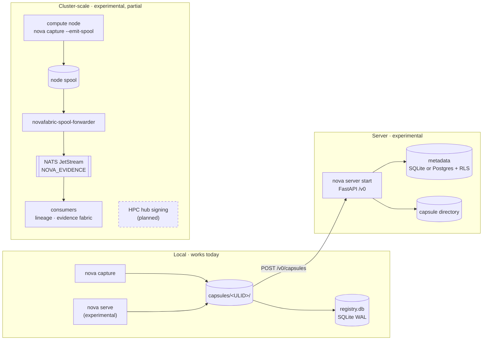

# Deployment topologies: local → server → cluster

[Architecture, as built](README.md) › Deployment topologies

> **Local-first now. Distributed-ready always. Cluster-scale later.**

All three tiers read and write the same Run Capsule format. Moving up a tier is a
deployment change, not a data migration. Each tier has a different maturity
today, and every component below carries its own label.

## Local mode (works today)

This is the default and needs no setup beyond installing the package.

| Component | As built | Where |
|---|---|---|
| Capture | Runs in the workload's own process through the `sitecustomize` hook loader. No daemon is needed. | `capture/`, `runners/` |
| Home directory | `NOVAFABRIC_HOME`, default `~/.novafabric` | `_paths.py:nova_home` |
| Capsules | `$NOVAFABRIC_HOME/capsules/<ULID>/` (or `NOVAFABRIC_CAPSULE_DIR`) | `_paths.py:default_capsule_dir` |
| Registry and lineage index | `$NOVAFABRIC_HOME/registry.db`, SQLite in WAL mode (or `NOVAFABRIC_DB_PATH`) | `_paths.py:registry_db_path`, `registry/store.py` |
| Runners | `local` (default), `docker`; `slurm` and `kubernetes` work today; `lsf` and `pbs` are experimental | `runners/_registry.py` |
| Warm capture daemon | Opt-in on Linux, to cut per-run startup time | experimental; see [warm-capture-daemon.md](../warm-capture-daemon.md) |
| Dashboard | `nova serve --experimental` binds to `127.0.0.1:4321`, requires a session token on every route, and is single-tenant | experimental; `serve/app.py`, see [dashboard.md](../dashboard.md) |

Local mode makes no network calls for core features. The one network
dependency is the RFC 3161 timestamp, and only when sealing is configured: it
calls a TSA unless `tsa_url: ""` is set (see
[Sealing and verification](sealing-and-verification.md#rfc-3161-timestamp)).

## Server mode (experimental)

`nova server start` (`cli/server.py`) runs uvicorn with the FastAPI app from
`server/app.py:create_app`. The routes are under `/v0`, and the default bind is
`127.0.0.1:7433`. `--workers N` runs several worker processes.

| Component | As built | Maturity |
|---|---|---|
| Authentication | OIDC/JWKS when configured. Otherwise an auto-generated local bearer token. `--insecure-no-auth` is an explicit opt-out. | experimental |
| Authorization | RBAC, and API keys via `nova server api-key create / list / revoke / rotate` | experimental |
| Identity provisioning | SCIM, and SAML behind an opt-in | experimental / partial |
| Metadata store | SQLite (default) or Postgres via `--backend postgres`; Postgres applies row-level security per transaction (`metadata_store/postgres.py`, `metadata_store/rls.py`) | experimental |
| Capsule bytes | A filesystem directory on the server (`server/deps.py:get_capsule_dir`), filled by `POST /v0/capsules` (`server/ingest.py`) or by indexing a directory | experimental |
| Tenancy | **Single-tenant today.** The server refuses to start with more than one organization unless the operator explicitly accepts a shared capsule store (`server/config.py`). | experimental |
| Packaging | `deploy/docker/` (Compose; the container runs the `nova serve` dashboard by default, and `NOVA_MODE=server` runs the API server) and `deploy/helm/novafabric` | experimental |

**Object storage.** `object_capsule_store/` implements an S3-compatible,
content-addressed capsule store with a write-once put protocol. Backends: S3,
MinIO, Ceph RGW, GCS, Azure Blob and local. It is used today by backup, batch
export and import, and rebuild. It is **not** wired into the server's capsule
routes. The library is experimental, and serving capsules from it in server mode
is not implemented.

## Cluster-scale (experimental, partial)

This tier is built on one invariant: **compute nodes never write to a database
or graph.** They append to a local spool, and something else ingests it.

| Hop | Component | As built | Maturity |
|---|---|---|---|
| 1 | `nova capture --emit-spool` | `capture/spool_sink.py:SpoolSink` writes Event Envelope v1 records (`schemas/event-envelope-v1/`) to the node spool. Opt-in. | experimental |
| 2 | Node spool | `$NOVAFABRIC_HOME/spool` (or `NOVAFABRIC_SPOOL_DIR`). It uses the Go `libnovaspool` when present (segments, checkpoints, dead-letter queue), otherwise a pure-Python fallback (`collector_cffi/spool.py`). | experimental |
| 3 | `novafabric-spool-forwarder` (Go) | Drains the spool to the NATS JetStream stream `NOVA_EVIDENCE` on `nova.evidence.<run_id>` (`collector/cmd/novafabric-spool-forwarder/`) | experimental |
| 4 | Consumers | `nova lineage consume` and the evidence-fabric NATS consumer index events into DuckDB, ClickHouse or Kuzu (`evidence_fabric/nats_consumer.py`) | experimental |
| — | OTel collector with the NovaSeal processor | A custom build via the OpenTelemetry Collector Builder (`collector/ocb/builder-config.yaml`) | experimental |
| — | HPC hub (central signing) | The binary exists in `collector/cmd/novafabric-hpc-hub/`, but its signing pipeline is not wired up. See `deploy/hpc/README.md`. | **planned** |
| — | Kubernetes collector manifests | `deploy/k8s/`. The collector image is not published. | **planned** |
| — | Writer lease with fencing tokens | `ha/lease.py` (Postgres and SQLite) | experimental primitive; automated failover is **planned** |
| — | Multi-cluster federation of capsules and lineage | — | **future design** |

The cluster path does not feed the server today. Captured capsules reach a
server only through `POST /v0/capsules` or directory indexing. The spool, NATS
and consumer path builds query and lineage indexes alongside the capsules.

For the step-by-step version with SLURM prolog and epilog scripts, see the
[cluster-scale tutorial](../tutorials/cluster-scale.md) and the
[operator guide](../operator-guide.md).

## Choosing a tier

| You have | Use | Why |
|---|---|---|
| A laptop, a workstation or an HPC login node | Local | Nothing to run. Capsules are portable folders. |
| A team that wants one place to browse and share capsules | Server (experimental), single tenant | Shared index, authentication, API keys |
| Many nodes producing runs at once | Local capture on each node, plus the spool and forwarder (experimental) | Keeps the hot path free of databases. Indexes are built off-node. |

## Read next

- [Operator guide](../operator-guide.md)
- [For platform teams](../for-platform-teams.md)
- [Architecture overview › Deployment modes](../architecture.md#deployment-modes)
