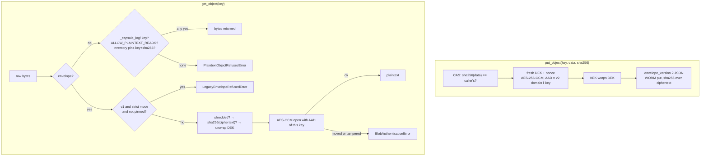

# Encryption at rest

[Architecture, as built](README.md) › Encryption at rest

The object capsule store can encrypt every capsule payload before it reaches the
WORM backend. The whole feature is **experimental** and **off by default**. It
turns on only when both `NOVA_OBJECT_STORE_ENCRYPTION=1` and
`NOVA_OBJECT_STORE_KEK_PATH` are set on the process that owns the store. Without
them, stored bytes are unchanged. Operator steps are in the
[encryption-at-rest guide](../ops/encryption-at-rest.md). This page shows the
data path.

Three decisions build on each other:

- **ADR-0185**: per-object envelope encryption. A fresh data-encryption key
  (DEK) per object, wrapped by a key-encryption key (KEK). Encrypt before the
  WORM write.
- **ADR-0290**: envelope v2 binds each envelope to its object key through
  AES-GCM associated data (AAD), and reads refuse plaintext.
- **ADR-0295**: a digest-pinned inventory of pre-encryption objects, and a strict
  mode that also refuses unbound v1 envelopes.

## Write path

| # | What happens | Code |
|---|---|---|
| 1 | The caller's SHA-256 over the plaintext is checked first, so a CAS mismatch fails before any cryptography or network call. | `object_capsule_store/encryption_wrapper.py:EncryptingAdapter._encrypt` |
| 2 | `encrypt_blob` draws a fresh 256-bit DEK and 96-bit nonce and encrypts with AES-256-GCM. The AAD is `novafabric/envelope-aad/v2\0` followed by the UTF-8 object key. | `trust/envelope_encryption.py:encrypt_blob`, `envelope_aad` |
| 3 | The KEK wraps the DEK. With `NOVA_OBJECT_STORE_TENANT_KEK_DIR`, a tenant that has its own `<tenant>.kek` gets its own KEK (ADR-0243). The envelope records `envelope_version: 2` and `content_sha256` over the ciphertext; the KEK itself never enters it. | `encrypt_blob`, `trust/tenant_keys.py` |
| 4 | The serialised envelope is what the WORM adapter stores, and the checksum handed to the backend is recomputed over those stored bytes. Integrity checks (hashes, Merkle leaves, WORM conformance) therefore never need the key. | `EncryptingAdapter.put_object` |

The AAD leaves out the KEK reference on purpose: re-wrapping a DEK under a new KEK
does not require re-encrypting the payload.

## Read path, in the order the checks run

| # | Check | On failure | Code |
|---|---|---|---|
| 1 | Is the object an envelope? Detection is by the envelope's marker fields and AEAD algorithm tag. | go to the plaintext rules below | `EncryptingAdapter._parse_envelope` |
| 2 | Plaintext rules, first match wins: a `_capsule_log/` key (chain-log objects are never encrypted); `NOVA_OBJECT_STORE_ALLOW_PLAINTEXT_READS=1` (warns on each read); the legacy inventory lists the key **and** the stored bytes still hash to its pinned SHA-256. | `PlaintextObjectRefusedError` | `EncryptingAdapter.get_object`, `legacy_inventory.py:LegacyInventory.admits` |
| 3 | Strict mode (`NOVA_OBJECT_STORE_REFUSE_V1_ENVELOPES=1`): an unbound v1 envelope must be pinned in the inventory. Checked before any key is unwrapped. | `LegacyEnvelopeRefusedError` | `EncryptingAdapter.get_object` |
| 4 | The envelope has not been crypto-shredded. | `ShreddedBlobError` | `decrypt_blob` |
| 5 | The ciphertext still hashes to `content_sha256`. Checked before any key material is touched. | `CiphertextIntegrityError` | `decrypt_blob` |
| 6 | The KEK unwraps the DEK. Any backend failure, local or cloud KMS, is mapped to one error without leaking SDK internals. | `DekUnwrapError` | `decrypt_blob` |
| 7 | AES-GCM opens the ciphertext with the AAD of the key **being read**. An envelope copied to another key fails here. | `BlobAuthenticationError` | `decrypt_blob` |

A v1 envelope that passes is decrypted and logs a warning, because it is not
bound and could have been moved. Rewriting `envelope_version` from 2 to 1 does not
help an attacker: the ciphertext was sealed with the AAD and fails without it.

## Start-up checks

`backend_router.make_adapter` reads the environment once:

- `NOVA_OBJECT_STORE_LEGACY_INVENTORY` names the inventory file. A missing,
  malformed or (with `NOVA_OBJECT_STORE_LEGACY_INVENTORY_SHA256`) pin-mismatched
  inventory **refuses to start**. A digest pin without an inventory is also a
  start-up error.
- If `ALLOW_PLAINTEXT_READS` is set alongside an inventory, it wins for plaintext
  reads, and a warning says so.

Why an inventory and not a timestamp cut-off: the only per-object time the reader
can see is the store's own modification time, and anyone who can write to the
store can set it.

## Limits

- Scope is the **object capsule store** only. The local capsule directory, the
  SQLite/Postgres metadata store and lineage data are not covered; use disk or
  database encryption there.
- `read_counters()` (`legacy_envelope_reads`, `plaintext_reads`,
  `inventory_reads`, `legacy_refusals`) live in process memory and reset on
  restart.
- An inventory built after someone substituted objects pins the substitutes.
  Build it at the cut-over, from a store you trust.
- The environment-variable wiring builds a local-file KEK only. The cloud KMS
  wrapping backends exist but must be passed to `EncryptingAdapter` in Python.
- Erasing a stored object means destroying the KEK that wrapped it. `shred()`
  cannot reach an envelope already locked by WORM retention.

## Read next

- [Encryption-at-rest operator guide](../ops/encryption-at-rest.md)
- [Sealing and verification](sealing-and-verification.md): integrity, which this
  feature leaves unchanged
- [Deployment topologies](deployment-topologies.md)
