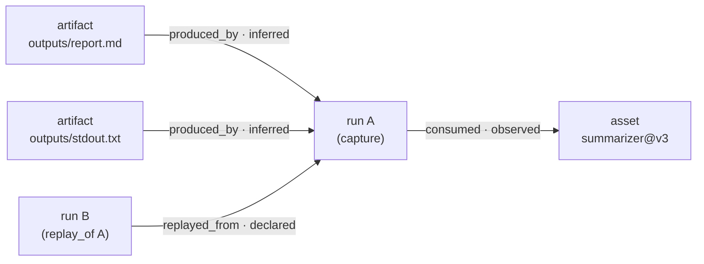

# The lineage graph

[Architecture, as built](README.md) › Lineage graph

Lineage answers two questions:

- **Provenance:** what did this run or artifact depend on?
- **Blast radius:** what depends on this asset?

Each capsule carries its own edges in `lineage.jsonl`. The graph you query is an
index built from those files, so it can always be rebuilt from the capsules.

**Maturity:** the SQLite store and the `nova lineage` queries work today. The
at-scale backends are experimental (see below).

## How edges are written

`lineage/_writer.py:LineageWriter` runs during `nova capture`, after
`capsule.yaml` exists and before the evidence digests are taken, so
`lineage.jsonl` is covered by the seal. It emits three edge types:

| Edge | Direction | Source of truth | Confidence |
|---|---|---|---|
| `consumed` | run → asset | each record in `assets.jsonl` (with `status_at_consumption` when recorded) | `observed` |
| `produced_by` | artifact → run | the `outputs` list in `capsule.yaml` | `inferred` |
| `produced_by` | artifact → run | explicit `record_produced()` calls (`produced.jsonl`) | `declared` |
| `replayed_from` | run → original run | `replay_of_run_id` in `capsule.yaml` | `declared` |

The lineage-edge schema (`schemas/lineage-edge.schema.json`) also reserves
`derived_from`, `evaluated_by`, `attested_by` and `depends_on`, and node kinds
`external` and `attestation`, for producers other than the capture writer. Agent
memory capture (`lineage/memory.py`) adds `memory` nodes with `wrote_memory` /
`read_memory` edges.

**Node identity.** A node ID is the first 26 hex characters of
`SHA-256("kind:ref")` (`lineage/_types.py:node_id_for`). The same asset seen by
two runs is therefore the same node, with no coordination between writers.

## How the index is built

`lineage/_importer.py:index_capsule_lineage` reads a capsule's `lineage.jsonl`
and calls `LineageStore.replace_capsule_lineage`. That call replaces all rows for
that capsule, so re-indexing is idempotent. The store
(`lineage/_store.py:LineageStore`) keeps two tables, `lineage_nodes` and
`lineage_edges`, in the local SQLite registry database (`registry.db`,
WAL mode). `nova lineage import` re-indexes capsules after the fact.

## Traversals

All four are recursive CTEs in `lineage/_store.py`, bounded by depth and guarded
against cycles.

| Query | CLI | Walks | Answers |
|---|---|---|---|
| `provenance` | `nova lineage provenance <ref>` | edges forward, source → target (artifact → run → asset) | What did this depend on? |
| `blast_radius` | `nova lineage blast-radius <ref>` | edges backward, target → source (asset ← run ← artifact) | What depends on this? |
| `replay_chain` | `nova lineage replay-chain <run>` | `replayed_from` edges, at most 100 hops | Which original run does this replay trace back to? |
| `time_travel` | `nova lineage time-travel <ref> --asof T` | edges recorded up to time T | What did the graph look like at time T? |

Other `nova lineage` subcommands:

- **Interop** (works today): `export-prov` (W3C PROV) and `emit-openlineage`
  (OpenLineage events). OpenLineage events are also emitted at capture time when
  `OPENLINEAGE_URL` is set.
- **Analytics** (experimental): `metrics`, `root-cause` and `export-graph`
  (GraphML, GEXF or Cypher), plus `nova insights`.
- **Cluster ingestion** (experimental): `consume` reads lineage events from NATS
  (see [Deployment topologies](deployment-topologies.md)).

## Storage backends

`lineage/store.py:AbstractLineageStore` defines the backend interface:
`insert`, `provenance`, `blast_radius` and `replay_chain`.
`lineage/backends/` holds five implementations:

| Backend | Class | Extra | Maturity |
|---|---|---|---|
| SQLite | `SqliteLineageStore` (wraps `LineageStore`) | none | **works today**, the default and the only backend the `nova lineage` CLI uses |
| Kuzu (embedded) | `KuzuLineageStore` | `lineage-kuzu` | experimental, library-level |
| Postgres (recursive CTE) | `PostgresLineageStore` | psycopg, through the `server` extra | experimental, library-level |
| Apache AGE (openCypher on Postgres) | `AGELineageStore` | psycopg | experimental, library-level |
| JanusGraph (Gremlin) | `JanusGraphLineageStore` | `janusgraph` | experimental, library-level |

"Library-level" means the backend is implemented and has integration tests, but
no `nova` command selects it yet. `nova lineage-store migrate` imports into the
SQLite store, and `nova lineage-store profile` prints a docker-compose profile for
a Kuzu or JanusGraph deployment. Selecting a non-SQLite backend from the CLI
is not implemented; use the backend classes from Python. Cross-cluster lineage federation is **future design**. See the
[lineage migration guide](../lineage/migration-guide.md) for the current
migration path.

## Read next

- [Concepts › Lineage Graph](../concepts.md#lineage-graph)
- [Deployment topologies](deployment-topologies.md)
