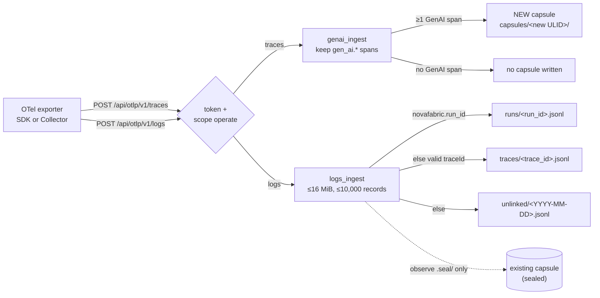

# OTLP ingest: traces and logs

[Architecture, as built](README.md) › OTLP ingest

`nova serve` accepts OpenTelemetry data on two routes, and they put it in two
different places:

| Route | What it accepts | Where it goes | Status |
|---|---|---|---|
| `POST /api/otlp/v1/traces` | `ExportTraceServiceRequest`, OTLP/HTTP JSON or protobuf | A **new** Run Capsule per export | experimental |
| `POST /api/otlp/v1/logs` | `ExportLogsServiceRequest`, OTLP/HTTP JSON or protobuf | An append-only **sidecar** log store outside every capsule | experimental |

The split exists because a capsule is written once. Trace ingest can always
create a fresh capsule. A log record usually belongs to a run that already has a
capsule, and that capsule may be sealed, so the record cannot go into it
(ADR-0293).

## Step by step

| # | What happens | Code |
|---|---|---|
| 1 | The exporter POSTs a trace export. Like every `serve` route, it first passes the [scope check](serve-request-path.md); both OTLP routes need `operate`. | `serve/app.py:otlp_ingest_traces`, `serve/authz.py:ROUTE_SCOPES` |
| 2 | Spans that carry at least one `gen_ai.*` attribute become model and tool calls. Every other span is counted as skipped, never guessed at. If no GenAI span is present, the response says so and **no capsule is written**. | `otel/genai_ingest.py:ingest_otlp_json`, `ingest_otlp_protobuf` |
| 3 | `write_ingest_capsule` writes a new capsule under a fresh ULID with the native `CapsuleWriter`, environment lock, secret scanner and replay policy. The manifest records `capture_mode: otel-import` and `metadata.capture_level: ingested-otlp`. | `otel/genai_ingest.py:write_ingest_capsule` |
| 4 | The exporter POSTs a logs export. A body over 16 MiB or more than 10,000 records is a 400, and nothing is written. Protobuf needs the `otlp` extra. | `otel/logs_ingest.py:ingest_otlp_logs_body` |
| 5 | Each record is routed by its link key: the `novafabric.run_id` attribute (record or resource), else a valid non-zero 32-hex `traceId`, else the UTC day of the record time. | `otel/logs_ingest.py:ingest_otlp_logs` |
| 6 | For a run-linked record, the run's capsule state is *observed*: `absent` (no `capsule.yaml`), `unsealed`, or `sealed` (`.seal/` present). The state is stamped on the record. The capsule directory is never opened for writing. | `otel/logs_ingest.py:_capsule_state`, `capsule/_manifest_write.py:is_sealed` |
| 7 | Lines are appended with one `O_APPEND` write under `flock`, to files created `0600` in directories created `0700`; symlinks are refused. Records that would push a stream past 64 MiB are rejected and counted in `partialSuccess.rejectedLogRecords`. | `otel/logs_ingest.py:_append_lines`, `_secure_dir` |

## Why a sealed capsule stays byte-identical

Neither route ever writes into an existing capsule:

- Trace ingest always creates a new directory. The route does not accept a run ID
  to append to.
- Logs ingest only reads two paths in the capsule directory (`capsule.yaml` and
  `.seal/`) to decide the `capsule_state` label. Every write goes under the
  sidecar root, `$NOVAFABRIC_OTLP_LOG_DIR` (default `$NOVAFABRIC_HOME/otlp-logs`).

So `nova verify` on a sealed capsule gives the same answer before and after any
number of log exports for that run. Every logs response says
`"capsule_amended": false` and
`"storage": "otlp-log-sidecar (not sealed evidence; ADR-0293)"`, and lists the
linked runs that were sealed under `sealed_runs`.

## What is stored for a log record

By default, metadata only (ADR-0009, ADR-0021 §9): times, raw severity and the
canonical `log_level`, trace and span IDs, `service.name`, the attribute *keys*,
and the body's type, UTF-8 length and SHA-256. With
`NOVAFABRIC_OTLP_LOGS_STORE_BODY=1`, the body text (up to 4,096 characters) and
string attribute values (up to 512) are also kept, after the ADR-0009 redaction
rules. Each record carries `schema: novafabric/otlp-log-record/v0`.

## Limits

- The sidecar is **correlation data, not evidence**. It is not signed, not
  covered by any seal, and not part of an Evidence Bundle.
- There is no `nova` command or HTTP route that reads the sidecar today. The
  Python function `otel.logs_ingest.read_log_records` reads one stream.
- Trace ingest writes a complete capsule but does not apply a NovaSeal
  signature. Seal it separately if you need one.
- An ingested capsule is honestly lower fidelity than native capture: it
  contains what the spans carried, and no command line or process output.

## Read next

- [The `nova serve` request path](serve-request-path.md): the scope check both routes pass
- [Sealing and verification](sealing-and-verification.md)
- [User guide: OTLP ingest](../user-guide.md) and the [API reference](../api-reference.md)
