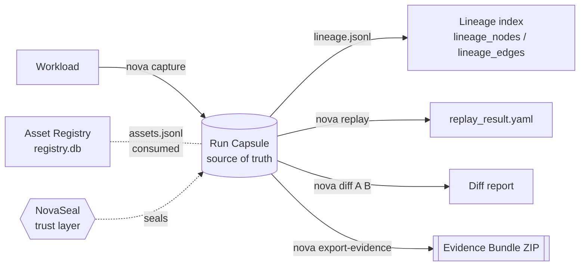
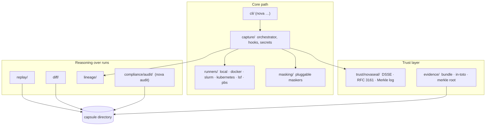

# System overview and the five primitives

[Architecture, as built](README.md) › Overview

NovaFabric is built from **five primitives**: Asset Registry, Run Capsule,
Replay, Lineage and Evidence Bundle. **Capture → Seal → Replay → Diff → Audit**
is the sequence that connects them. Cryptographic sealing (NovaSeal) is a trust
layer over capsules and bundles, not a sixth primitive.

## The invariant everything follows

> **The Run Capsule on disk is the source of truth.** The registry, the metadata
> store and the lineage graph are indexes derived from capsules, and can be
> rebuilt from them.

Three consequences of this invariant are visible in the code:

- The **lineage index** is rebuilt from each capsule's `lineage.jsonl`.
  `lineage/_importer.py:index_capsule_lineage` replaces a capsule's rows rather
  than accumulating them.
- **Sealing reads only the capsule.** The signed payload is the capsule's own
  manifest, `capsule.yaml`, which carries a SHA-256 digest of every other
  evidence file in the capsule
  (`capture/orchestrator.py`, `trust/novaseal/__init__.py:NovaSeal.seal`).
- **There are only two top-level formats.** The Run Capsule is a directory and
  the Evidence Bundle is a ZIP. Everything else, such as `replay_result.yaml` or
  a diff report, is a report about a capsule, not a new container format.

## The five primitives

| # | Primitive | As built | Lives in | Maturity |
|---|---|---|---|---|
| 1 | **Asset Registry** | A SQLite registry of versioned assets (`name@version`) with a six-state lifecycle: `development`, `validated`, `pending_approval`, `staging`, `production`, `archived` | `registry/service.py`, `registry/store.py`, `spec/models.py:AssetStatus` | works today |
| 2 | **Run Capsule** | A directory named by a 26-character ULID, holding the manifest, call streams, environment, outputs and the redaction proof of one execution. Written by `nova capture`, or from inside the process by a framework adapter or the `@agent` decorator (`novafabric.sdk.agent`; a [smaller evidence pipeline](run-capsule.md#capsules-written-inside-a-framework-call)) | `capture/orchestrator.py:CaptureOrchestrator`, `capture/capsule.py:CapsuleWriter`, `schemas/run-capsule.schema.json` | works today (on-disk format not frozen before v1.0) |
| 3 | **Replay** | Re-runs a capsule's command with recorded model responses (and recorded SDK errors) and recorded MCP tool results, while other tools run live; or analyses the capsule without executing anything. Five modes. `mocked` refuses a capsule that records no command to re-run. | `replay/_engine.py:ReplayEngine`, `cli/replay.py` | works today; `intervention` mode is experimental |
| 4 | **Lineage** | A directed graph of runs, assets and artifacts, written per capsule and indexed into SQLite | `lineage/_writer.py`, `lineage/_store.py`, `lineage/backends/` | works today (SQLite); other backends experimental |
| 5 | **Evidence Bundle** | A ZIP holding the capsule, a lineage subgraph, Ed25519-signed in-toto DSSE attestations and vendored schemas | `evidence/bundle.py:EvidenceBundleBuilder`, `cli/export_evidence.py` | works today |

## How the code is organised

Everything is in `src/novafabric/`. The [subsystem map](../architecture.md#subsystem-map)
lists every package. The ones that implement the five primitives:

## What runs where

- **Capture runs inside the workload's own process.** The runner puts a
  `sitecustomize.py` hook loader on the child's `PYTHONPATH`
  (`runners/_sitecustomize.py`). The hooks record calls in-process. No daemon or
  server is involved.
- **Everything after capture is a CLI command over a capsule directory.**
  `nova verify`, `nova replay`, `nova diff`, `nova export-evidence` and
  `nova audit` all take a capsule path or a run ID.
- **Servers are optional.** See [Deployment topologies](deployment-topologies.md)
  for `nova serve` (local dashboard, experimental) and `nova server` (team server,
  experimental).

## Read next

- [The pipeline](pipeline.md): each verb, step by step.
- [Run Capsule anatomy](run-capsule.md): what is inside the directory.
- [Concepts](../concepts.md): the conceptual reference for every noun used here.
