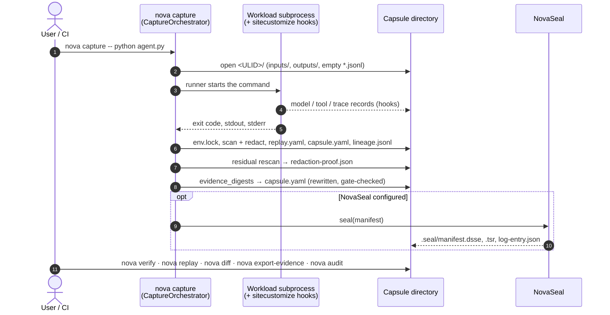

# The pipeline: capture → seal → replay → diff → audit

[Architecture, as built](README.md) › Pipeline

The five verbs are separate `nova` commands that all work on one capsule
directory. Seal is the exception: it runs automatically at the end of
`nova capture` when NovaSeal is configured. Any later step can run on another
machine, years later, from a copy of the directory.

## 1 · Capture: `nova capture` (works today)

`cli/capture.py:capture_cmd` builds a `capture/orchestrator.py:CaptureOrchestrator`
and calls `run()`. If the warm-capture daemon is reachable and no flags need the
in-process path, the command goes to the daemon instead (see
[warm-capture-daemon.md](../warm-capture-daemon.md)). `run()` works through these
stages in order:

1. **Pre-flight gates**, before anything is written: required asset status
   (`--require-asset-status`), deployment environment, A/B variant, session
   membership.
2. **Open the capsule.** It gets a new ULID (`capture/_ulid.py`), and
   `capture/capsule.py:CapsuleWriter.open()` creates the directory with
   `inputs/`, `outputs/` and empty call streams.
3. **Start recording.** `capture/event_recorder.py:EventRecorder` starts, and the
   environment snapshot (`capture/env.py`) is taken on a background thread so it
   overlaps the workload.
4. **Run the workload.** The selected runner (`runners/`: `local` by default;
   also `docker`, `kubernetes`, `slurm`, `lsf`, `pbs`) writes the
   `sitecustomize.py` hook loader onto the child's `PYTHONPATH`. In the child,
   `capture/hooks/__init__.py:install_all` patches the supported SDKs and HTTP
   clients.
5. **Redact.** After `env.lock` is written,
   `capture/secrets.py:SecretScannerV0.scan_and_redact` always runs over every
   file that exists at that point: the call and event streams, `env.lock`,
   `assets.jsonl`, and every file under `inputs/` and `outputs/` (recursively;
   symlinks are not followed). Matches in text are redacted in place. A binary
   that carries a key-shaped match, or a file whose *name* carries one, is
   dropped. Any configured maskers (`masking/`, experimental) then run over the
   same files.
6. **Write the manifest and lineage.** The orchestrator writes `replay.yaml`. The
   manifest is redacted as a data structure (built-in rules, then maskers, then
   the built-in rules again) before `capsule.yaml` is written, so a key on the
   command line is not written to disk. `lineage/_writer.py:LineageWriter` then
   writes `lineage.jsonl`, which is scanned and masked straight away, and the
   edges are indexed.
7. **Residual pass and proof.** If the event recorder dropped any events,
   `capture-health.json` is written first, so it is rescanned and digested like
   every other file. `SecretScannerV0.residual_scan` then rescans every
   file in the finished capsule except `capsule.yaml`, the proof and `.seal/`.
   That includes files written after step 5 (`replay.yaml`, the C2PA marker) and
   files a masker rewrote. A match is redacted and recorded like any other
   finding. Each file's after-hash is updated to the bytes on disk, and the pass
   is recorded in `residual_check`. `redaction-proof.json` is then written,
   once.
8. **Digest and gate.** `evidence_digests` records a SHA-256 and size for every
   evidence file, including the proof. Before `capsule.yaml` is rewritten, the
   final manifest is checked against the rules
   (`SecretScannerV0.assert_manifest_clean`). If anything matches, the manifest
   is redacted, the capsule is **not sealed**, and capture prints an error. The
   workload's exit code is unchanged.
9. **Seal**, if configured. See step 2 below.

Steps 5–8 work today. Detection is rule-based (`gitleaks-core-v0`, pack 0.7.0),
so a secret in a format no rule matches is not found. For example, a bare AWS
secret access key is matched only when its key name is next to it, and PEM
private keys, JWTs and passwords are not matched at all. The full list:
[what the scanner does not detect](run-capsule.md#what-the-scanner-detects-and-what-it-does-not).

A failed workload still produces a complete capsule with `status: failure`. If a
NovaFabric component fails, the failure is recorded and the workload continues.

Capture also has proxy paths for clients that cannot be hooked in-process:
`nova api-proxy` (`proxy/api_proxy.py`) and `nova mcp-proxy`
(`proxy/mcp_proxy.py`).

Details: [Run Capsule anatomy](run-capsule.md).

## 2 · Seal: automatic when configured (experimental)

`capture/orchestrator.py:_seal_capsule` runs as the last step of capture, but
only if a NovaSeal configuration exists (`NOVAFABRIC_SEAL_CONFIG` or
`~/.novafabric/novaseal.yaml`). Without one, sealing is skipped. A sealing
failure prints a warning and never fails the capture. A seal produces three
files in `.seal/`:

- a DSSE signature over the manifest,
- an RFC 3161 timestamp token,
- an entry in an append-only Merkle log.

`nova seal propose` / `approve` / `verify` add an optional maker-checker
signature chain on top (`cli/seal_propose.py`).

Details: [Sealing and verification](sealing-and-verification.md).

## 3 · Replay: `nova replay` (works today; `intervention` experimental)

`cli/replay.py:replay_cmd` → `replay/_engine.py:ReplayEngine.run`. The default
mode, `mocked`, re-runs the captured command with OpenAI and Anthropic responses
served from the record. `forensic`, `semantic` and `exact` analyse the capsule without re-running it. Every mode
writes `.novafabric/replays/<ulid>/replay_result.yaml`. `intervention` is the
only mode that also writes a new capsule.

Details: [Replay modes](replay-modes.md).

## 4 · Diff: `nova diff A B` (works today)

`cli/diff.py:diff_cmd` → `diff/_engine.py:DiffEngine.compare`. It takes two
capsule paths or run IDs and compares:

| Facet | How it matches | "Changed" means |
|---|---|---|
| Environment | Fixed keys from `env.lock`: Python version and interpreter, OS, architecture | Value differs |
| Model calls | `diff/_align.py`: a `parent_span_id` unique on both sides pairs exactly; the rest pair by sequence position, anchored on identical requests so an inserted or deleted call does not shift later pairs. Unpaired calls count as added or removed | Provider (`gen_ai.system`), request model or messages differ, or the response choices differ |
| Tool calls | Exact `(tool_name, arg_hash)` match, each call used once, then position among calls with the same tool name | `result` or `arguments` differ |
| Outputs | Every regular file under `outputs/`, recursively, by capsule-relative path; symlinks skipped and never followed (the evidence-digest rule) | SHA-256 differs, or the path exists on one side only |

The output format is `text`, `json` or `github-annotation`. Whether the report
has any difference is one property, `DiffReport.has_changes` (a changed, added
or removed entry in any section). `--assert-no-regressions` exits 1 on it,
which turns the command into a CI gate; the `text` and `github-annotation`
formatters read the same property, so an added- or removed-only diff is an
`error` annotation, never a `notice`, and the `json` report carries it as a
top-level `has_changes`. Exit `1` means only "the comparison found a
difference"; a comparison that could not be made (a capsule ref that does not
resolve, an unknown asset ref, a usage error) exits `2` (ADR-0303). A record
line the engine cannot read (not UTF-8, not JSON, not a JSON object) is skipped,
counted per side in `skipped_malformed_lines`, and warned about on stderr; under
`--assert-no-regressions` it exits `2` as well, because the comparison is
incomplete (ADR-0303 Amendment 1). `nova diff` also accepts two `name@version`
asset references and diffs their specs field by field, in any of the three
output formats.

An OpenAI or Anthropic SDK call leaves two kinds of record in `model-calls.jsonl`:
the SDK hook's logical record and one `httpx` wire record per HTTP attempt, with no
response. Since ADR-0305 the wire records are marked `transport` and `nova diff`
aligns logical calls only, so a changed prompt is one changed pair; a capsule
captured before the marker existed is read the same way, through the reader-side
fallback described in [Model-call record roles](run-capsule.md#model-call-record-roles).

## 5 · Audit: `nova verify`, `nova export-evidence`, `nova audit` (works today)

"Audit" names three commands that produce or check evidence:

| Command | What it does | Module |
|---|---|---|
| `nova verify <capsule>` | Checks the seal: DSSE signature, timestamp, Merkle inclusion, manifest binding and per-file digests. Exit 0 or 1. It also verifies an Evidence Bundle `.zip` by recomputing every artifact digest. | `cli/verify.py` |
| `nova export-evidence <capsule>` | Builds the **Evidence Bundle** ZIP: the capsule, a lineage subgraph, Ed25519-signed in-toto DSSE attestations (`run`, `redaction`, `lineage`), vendored schemas and a `manifest.json` | `evidence/bundle.py:EvidenceBundleBuilder` |
| `nova audit map / report / bundle / coverage` | Maps capsule evidence to the controls of a regulatory profile (default `nist-ai-rmf`) | `cli/audit.py`, `compliance/audit/` |

The Evidence Bundle is the artifact you hand to a third party. Its
`manifest.json` contains its own verification recipe: recompute each artifact's
SHA-256, then check the Ed25519 signatures. Any SHA-256 tool and Ed25519
verifier can run that recipe without NovaFabric. A bundle cannot be exported from
a capsule that has no `redaction-proof.json`.

## Read next

- [Sealing and verification](sealing-and-verification.md)
- [Prove a run to an auditor](../tutorials/prove-a-run-to-an-auditor.md) (tutorial)
- [How capture works](../tutorials/how-capture-works.md) (tutorial)
