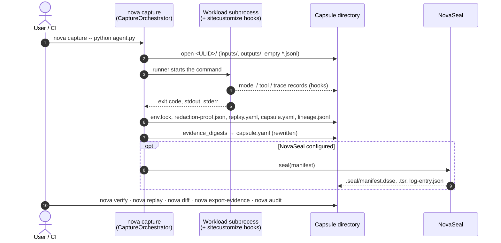

# The pipeline: capture → seal → replay → diff → audit

[Architecture, as built](README.md) › Pipeline

The five verbs are separate `nova` commands that all work on one capsule
directory. Seal is the exception: it runs automatically at the end of
`nova capture` when NovaSeal is configured. Any later step can run on another
machine, years later, from a copy of the directory.

## 1 · Capture: `nova capture` (works today)

`cli/capture.py:capture_cmd` builds a `capture/orchestrator.py:CaptureOrchestrator`
and calls `run()`. If the warm-capture daemon is reachable and no flags need the
in-process path, the command goes to the daemon instead (see
[warm-capture-daemon.md](../warm-capture-daemon.md)). `run()` works through these
stages in order:

1. **Pre-flight gates**, before anything is written: required asset status
   (`--require-asset-status`), deployment environment, A/B variant, session
   membership.
2. **Open the capsule.** It gets a new ULID (`capture/_ulid.py`), and
   `capture/capsule.py:CapsuleWriter.open()` creates the directory with
   `inputs/`, `outputs/` and empty call streams.
3. **Start recording.** `capture/event_recorder.py:EventRecorder` starts, and the
   environment snapshot (`capture/env.py`) is taken on a background thread so it
   overlaps the workload.
4. **Run the workload.** The selected runner (`runners/`: `local` by default;
   also `docker`, `kubernetes`, `slurm`, `lsf`, `pbs`) writes the
   `sitecustomize.py` hook loader onto the child's `PYTHONPATH`. In the child,
   `capture/hooks/__init__.py:install_all` patches the supported SDKs and HTTP
   clients.
5. **Redact.** `capture/secrets.py:SecretScannerV0.scan_and_redact` always runs,
   followed by any configured maskers (`masking/`). Both feed
   `redaction-proof.json`.
6. **Write the manifest and lineage.** The orchestrator writes `replay.yaml` and
   `capsule.yaml`, then `lineage/_writer.py:LineageWriter` writes
   `lineage.jsonl` and the edges are indexed.
7. **Digest.** `evidence_digests` records a SHA-256 and size for every evidence
   file, and `capsule.yaml` is rewritten.
8. **Seal**, if configured. See step 2 below.

A failed workload still produces a complete capsule with `status: failure`. If a
NovaFabric component fails, the failure is recorded and the workload continues.

Capture also has proxy paths for clients that cannot be hooked in-process:
`nova api-proxy` (`proxy/api_proxy.py`) and `nova mcp-proxy`
(`proxy/mcp_proxy.py`).

Details: [Run Capsule anatomy](run-capsule.md).

## 2 · Seal: automatic when configured (experimental)

`capture/orchestrator.py:_seal_capsule` runs as the last step of capture, but
only if a NovaSeal configuration exists (`NOVAFABRIC_SEAL_CONFIG` or
`~/.novafabric/novaseal.yaml`). Without one, sealing is skipped. A sealing
failure prints a warning and never fails the capture. A seal produces three
files in `.seal/`:

- a DSSE signature over the manifest,
- an RFC 3161 timestamp token,
- an entry in an append-only Merkle log.

`nova seal propose` / `approve` / `verify` add an optional maker-checker
signature chain on top (`cli/seal_propose.py`).

Details: [Sealing and verification](sealing-and-verification.md).

## 3 · Replay: `nova replay` (works today; `intervention` experimental)

`cli/replay.py:replay_cmd` → `replay/_engine.py:ReplayEngine.run`. The default
mode, `mocked`, re-runs the captured command with OpenAI and Anthropic responses
served from the record. The other four modes analyse the capsule. Every mode
writes `.novafabric/replays/<ulid>/replay_result.yaml`. `intervention` is the
only mode that also writes a new capsule.

Details: [Replay modes](replay-modes.md).

## 4 · Diff: `nova diff A B` (works today)

`cli/diff.py:diff_cmd` → `diff/_engine.py:DiffEngine.compare`. It takes two
capsule paths or run IDs and compares:

| Facet | How it matches | "Changed" means |
|---|---|---|
| Environment | Fixed keys from `env.lock`: Python version and interpreter, OS, architecture | Value differs |
| Model calls | Paired by `parent_span_id` (`diff/_align.py`); unpaired calls count as added or removed | Request model or messages differ, or the response choices differ |
| Tool calls | Paired by `(tool_name, arg_hash)` | `result` differs |
| Outputs | Each file under `outputs/` | SHA-256 differs |

The output format is `text`, `json` or `github-annotation`.
`--assert-no-regressions` makes the command exit non-zero when the report has
changes, which turns it into a CI gate. `nova diff` also accepts two
`name@version` asset references and diffs their specs.

## 5 · Audit: `nova verify`, `nova export-evidence`, `nova audit` (works today)

"Audit" names three commands that produce or check evidence:

| Command | What it does | Module |
|---|---|---|
| `nova verify <capsule>` | Checks the seal: DSSE signature, timestamp, Merkle inclusion, manifest binding and per-file digests. Exit 0 or 1. It also verifies an Evidence Bundle `.zip` by recomputing every artifact digest. | `cli/verify.py` |
| `nova export-evidence <capsule>` | Builds the **Evidence Bundle** ZIP: the capsule, a lineage subgraph, Ed25519-signed in-toto DSSE attestations (`run`, `redaction`, `lineage`), vendored schemas and a `manifest.json` | `evidence/bundle.py:EvidenceBundleBuilder` |
| `nova audit map / report / bundle / coverage` | Maps capsule evidence to the controls of a regulatory profile (default `nist-ai-rmf`) | `cli/audit.py`, `compliance/audit/` |

The Evidence Bundle is the artifact you hand to a third party. Its
`manifest.json` contains its own verification recipe: recompute each artifact's
SHA-256, then check the Ed25519 signatures. Any SHA-256 tool and Ed25519
verifier can run that recipe without NovaFabric. A bundle cannot be exported from
a capsule that has no `redaction-proof.json`.

## Read next

- [Sealing and verification](sealing-and-verification.md)
- [Prove a run to an auditor](../tutorials/prove-a-run-to-an-auditor.md) (tutorial)
- [How capture works](../tutorials/how-capture-works.md) (tutorial)
