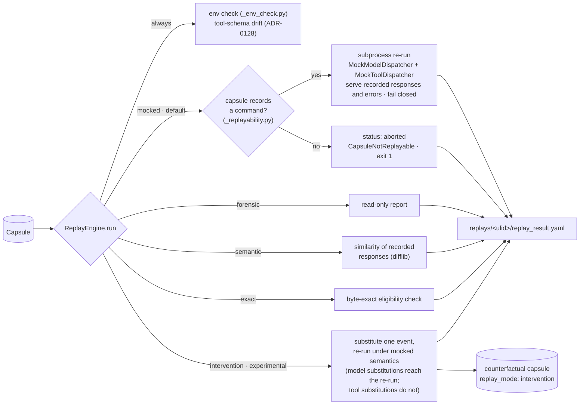

# Replay modes

[Architecture, as built](README.md) › Replay modes

`nova replay <capsule|run-id> --mode <mode>` (`cli/replay.py:replay_cmd`) loads a
capsule and passes it to `replay/_engine.py:ReplayEngine.run`. There are five
modes. Two of them, `mocked` and `intervention`, run the captured command again.
The other three read the capsule and execute nothing.

Every flag of these commands: [CLI reference — nova replay, diff and diagnose](../cli-reference.md#replay-commands-v03).

> **Release scope.** This page describes **v0.105.0**, the current release. The following
> shipped in v0.105.0: recorded MCP `call_tool` results served (ADR-0300), the fail-closed
> contract and `--permissive`, async / streamed / Responses API serving and live-network
> reporting (ADR-0304), replay of recorded model errors (**experimental**), the
> transport-record rule (ADR-0305), refusing capsules with no command to re-run,
> **experimental** serving of functions declared with `novafabric.capture.record.tool`
> (ADR-0306 slice 1), and — also **experimental** — `replay.yaml` `tool_overrides`
> enforced inside the replayed process, with `--permissive` needing the ladder flag before
> an unmatched MCP call runs live (ADR-0306 slice 2). In **v0.104.0** and earlier, `mocked`
> replay served recorded responses only for synchronous, non-streaming OpenAI chat
> completions and Anthropic messages, and every tool ran live; rows of the support matrix
> below that cite those ADRs do not apply to those versions.

## What every mode does first

Before it branches, `ReplayEngine.run`:

- loads `capsule.yaml`, `replay.yaml`, `env.lock`, `model-calls.jsonl` and
  `tool-calls.jsonl`;
- compares the recorded environment with the current one
  (`replay/_env_check.py:EnvironmentResolver`) and records any differences as
  `env_warnings`;
- re-validates each recorded tool call against its **current** declared schema
  (`capture/schema_validation.py:revalidate_tool_calls`, ADR-0128) and records
  any drift. Only `exact` mode refuses on drift.
- if `--allow-mutating` is passed, evaluates the `replay_mutating` policy and
  writes the decision to the audit log.

Every mode writes `replay_result.yaml` (`replay/_result.py:write_replay_result`,
`schemas/replay-result.schema.json`) under `.novafabric/replays/<ulid>/` in the
current directory, or under `-o <dir>`.

## The modes

| Mode | Executes the command? | What it does | Maturity |
|---|---|---|---|
| `mocked` (default) | **Yes**, in a subprocess, with a 600 s timeout | Re-runs `capsule.yaml:command` (a capsule with no command to re-run is refused up front — see [which capsules each mode accepts](#which-capsules-each-mode-accepts)). A `sitecustomize.py` installs `replay/_dispatcher.py:MockModelDispatcher` (recorded responses for the supported model surfaces — sync or async, streamed or not — one queue per API surface) and `MockToolDispatcher` (recorded MCP `ClientSession.call_tool` results, and — experimental, ADR-0306 — results of functions declared with `record.tool`, both matched one-to-one). **Fail-closed** on divergence; `--permissive` only reports. Tools on other surfaces run live; outbound connections are reported, not blocked. See [the mocked-replay contract](#the-mocked-replay-contract-adr-0300-adr-0304) and the [support matrix](#support-matrix). | works today (Python workloads, supported surfaces only) — the MCP, async/streamed and error serving shipped in v0.105.0 (error serving is experimental); see *Release scope* above |
| `forensic` | No | Read-only inspection. Reports call counts, environment warnings and schema drift. | works today |
| `semantic` | No | Scores how similar the recorded model responses within the capsule are to one another: the mean pairwise `difflib.SequenceMatcher` ratio, from 0.0 to 1.0. This is a **text** similarity, not a judgment of meaning, and no live model is called. | works today |
| `exact` | No | An **eligibility check** for byte-exact replay. It requires `env.lock` mode `deterministic` and a `gen_ai.request.seed` on every model call, and refuses if there is any tool-schema drift. Reports `exact_eligible` and `exact_reasons`. | works today |
| `intervention` | **Yes**, under mocked semantics | Needs `--intervention-file spec.yaml`. Substitutes one recorded model or tool event as the `InterventionSpec` describes (`replay/_intervention.py`), re-runs everything downstream with zero live model calls (a substituted **model** response reaches the re-run; a substituted **tool** result does not — tools run live, and the result records `intervention.substitution_delivered_to_workload: false`), and writes a minimal counterfactual capsule (`capsule.yaml` with `replay_mode: intervention` and `replay_of_run_id`, plus the call streams), so you can `nova diff` it against the original. | experimental (ADR-0086) |

## Which capsules each mode accepts

`mocked` and `intervention` re-run `capsule.yaml:command`, so they need a capsule that
records a real argv. `replay/_replayability.py:not_reexecutable_reason` is the one
check; it runs before anything is spawned. A capsule has **no command to re-run** when
its `capture_mode` is `sdk-decorator` (written inside a framework call by a framework
adapter in `novafabric.adapters` or by the `@agent` decorator (`novafabric.sdk.agent`); `command` is
a label such as `@langgraph:demo`) or `otel-import` (built from OpenTelemetry spans;
`command` is empty), or when `command` is empty or starts with `@`.

| Mode | `cli-wrapper` capsule (`nova capture`) | No command to re-run (`sdk-decorator`, `otel-import`, empty) |
|---|---|---|
| `forensic` | works | works |
| `semantic` | works | works |
| `exact` | eligibility report | eligibility report: always `exact_eligible: false`, with the reason in `exact_reasons` |
| `mocked` | re-runs the command | **refused** before spawning: `status: aborted`, `error.type: CapsuleNotReplayable` (`replay/_errors.py:CapsuleNotReplayableError`), exit 1; `--dry-run` prints the same `REFUSED:` message and also exits 1 |
| `intervention` | re-runs the command under mocked semantics | emits the counterfactual capsule **without** re-running; `intervention.downstream_reexecuted: false`, `downstream_not_reexecuted_reason` and `substitution_delivered_to_workload: false` say so |

Re-running a framework-adapter capsule would need the framework call to be rebuilt
from the capsule; that is future design (ADR-0306, open question 7).

## The mocked-replay contract (ADR-0300, ADR-0304)

`replay/_contract.py` is the one place that decides what the dispatchers may
serve and how a replay is summarised; the engine and the in-process dispatchers
both use it.

**What is served.** A recorded model call is servable when it belongs to a
served API surface — OpenAI Chat Completions, the OpenAI Responses API (records
marked `extensions["io.novafabric.api_surface"]: "openai.responses"`), or
Anthropic Messages — its `status` is `success`, and it has at least one recorded
choice. Each surface has its own queue, in recorded order; a sync, async or
`stream=True` call to a surface takes the next record from that queue, and a
streamed call gets the record back as the chunk or event stream the SDK would
have produced (ADR-0304). (Every SDK call is also recorded by the `httpx` wire
hook, once per HTTP attempt, with no choices; since ADR-0305 those records are
marked `transport`, and they are never served or counted. See
[Model-call record roles](run-capsule.md#model-call-record-roles).)

**Recorded model errors are served too** (issue #16). When the captured call
raised — a rate limit, a 4xx, a 5xx after the SDK's own retries, a timeout or a
connection error — the SDK hook wrote one logical error record carrying
`extensions["io.novafabric.sdk_error"]`: the exception class, HTTP status,
message, parsed error body, request id, and the retry and rate-limit response
headers. That record holds its position in the surface's queue, and the replayed
call there **raises the same SDK exception class** (`openai.RateLimitError` with
`status_code == 429`, `body`, `request_id`, and a synthetic `response` carrying
the recorded status, headers and body), sync or async, streamed or not. Classes
come from an explicit allow-list per SDK (`replay/_model_errors.py:ALLOWED_SDK_ERRORS`:
the `APIStatusError` family, `APIConnectionError`, `APITimeoutError`), looked up
on the SDK package itself — never imported by a name read from the capsule. The
wire hook's record of each HTTP attempt is a transport record (ADR-0305) and is
never served, so a call the SDK retried twice and then completed is served as
the success it was; in a capsule captured before ADR-0305, the legacy fallback
identifies those attempts instead. A recorded error that cannot be rebuilt
faithfully — a class outside the allow-list, a missing status, a body too large
to have been recorded, or a capsule captured before the error detail was
recorded — is the divergence `recorded_error_unreconstructable`.

A recorded tool call is
servable when it is an MCP `tools/call` with a tool name; a call captured both by
the in-process MCP hook and by `nova mcp-proxy` counts once.

**Declared Python tools** (ADR-0306 slice 1, **experimental**). A function the
workload decorates with `novafabric.capture.record.tool` is a second intercepted
tool surface, `novafabric.capture.record.tool`. Under `nova capture` each call
writes one `tool-calls.jsonl` record with `transport: "python"` and the marker
`extensions["io.novafabric.tool_surface"]: "python.function"` (no schema change).
In a mocked replay, `MockToolDispatcher` registers a server with the façade, and
the decorator asks it **before the function body runs**. The record is served
only when capture marked it `io.novafabric.result_codec: "json-v1"`: arguments
and result were kept (capture level `forensic` or `air_gapped` —
`NOVA_CAPTURE_LEVEL`; at lower levels only digests are kept), every argument was
JSON-native (exclude others with `ignore=`), the result was JSON-native and at
most `NOVAFABRIC_TOOL_RESULT_MAX_BYTES` (default 1 MiB), and no model or tool
record was written inside the call (nested records are marked
`io.novafabric.within_tool_call_id` and make the boundary unservable in slice 1).
A recorded exception is raised again as the same class only when it is a builtin
`Exception` subclass; anything else is `ReplayRecordedToolError`. Results are
decoded as JSON only — never unpickled or imported by name.

**How tool calls are matched** (`ToolCallMatcher`, one matcher per tool
surface — a `record.tool` record never answers an MCP call of the same name, nor
the reverse), one-to-one: by an exact
`tool_call_id` when the surface carries one (MCP `call_tool` does not); else by
tool name plus an order-insensitive hash of the arguments, earliest unconsumed
record first — so repeated identical calls get distinct recorded results in
recorded order. A record is never served twice. Anything else is **unmatched**.
A `record.tool` call is first bound to the function's signature with defaults
applied, so `f(1)`, `f(1, b=2)` and `f(a=1, b=2)` match the same record. The
matcher is indexed by name and argument hash, so a lookup does not scan the
capsule.

**Divergence policy.** Under the default `fail` policy the replayed process
raises a named `ReplayDivergenceError` subclass (`replay/_errors.py`) at the call
that diverged, instead of fabricating a reply or reaching the network:

| Divergence kind | When |
|---|---|
| `model_queue_exhausted` | more calls to an API surface than were recorded (`provider`, `surface`, `call_index`, `recorded_queue_length` reported) |
| `provider_mismatch` | the same, while another surface's recordings are unconsumed (e.g. a Chat Completions recording, replayed through the Responses API) |
| `order_mismatch` | a call reaches a different API surface than the recording did at that position (`surface`, `expected_surface`) |
| `unsupported_surface` | `chat.completions.parse`, `responses.parse`, legacy completions, Anthropic `messages.stream()` and `beta.messages`, `with_raw_response` / `with_streaming_response` |
| `malformed_recorded_response` | a recorded tool-call entry has no `name` |
| `recorded_error_unreconstructable` | the recorded call failed, and replay cannot raise that failure faithfully (`error_type`, `reason` reported); under `--permissive` a `ReplayRecordedModelError` stand-in with the recorded type and message is raised instead |
| `tool_call_unmatched` | an MCP `call_tool` or `record.tool` call with no unconsumed recorded result — **the live tool is not run** |
| `tool_result_not_servable` | a `record.tool` call matched a record whose result cannot be served, or has an argument that is not JSON-representable; `reason` names the cause (payloads not recorded, tuple/object result, size cap, the parameter, nested records) — **the function body is not run**. Counted as a tool divergence |
| `override_unenforceable` | `--permissive` only (a strict replay refuses to start instead): a `replay.yaml` `allow: false` override names a tool recorded on a transport replay cannot intercept, so it ran live (`tool_name`, `transports` reported; experimental, ADR-0306) |
| `model_calls_unconsumed` / `tool_calls_unconsumed` | (after the run) recorded responses that were never requested |
| `dispatcher_install_failed`, `multiple_interpreters` | the dispatcher could not be installed (the process is stopped, exit 86, before the workload runs), or several Python processes each consumed the queue |

Any divergence makes the result `status: failure` with `error.type:
ReplayDivergence` and a `divergence_reason` — even when the workload caught the
exception and exited 0, because the engine reads the dispatchers' event log, not
just the exit code. `--permissive` (`ReplayFlags(permissive=True)`) switches to
the `warn` policy: an exhausted queue serves an empty reply with a warning (the
pre-ADR-0300 behaviour), unsupported model surfaces run live, and every
divergence is still recorded. An unmatched intercepted tool call — MCP or
`record.tool`, or a `record.tool` call whose record cannot be served — runs live
under `--permissive` **only** when the operator's ladder flag permits its
`mutation_class` (`none` always; `--allow-readonly`, `--allow-mutating`,
`--allow-external-side-effects`, `--allow-unknown-mutation` for the others,
ADR-0012); otherwise it is refused (`tool_calls_refused`). For `record.tool`
the class comes from the decorator in the workload's code; an MCP call is
always `unknown`, so it needs `--allow-unknown-mutation`. The class a capsule
records is never used to permit anything. *(Changed in v0.105.0, ADR-0306 Q3:
before, `--permissive` alone ran every unmatched MCP call live.)* `intervention`
always uses `warn` and installs no tool dispatcher, because a counterfactual is
expected to diverge.

**`replay.yaml` `tool_overrides` (experimental, ADR-0306 slice 2).** The engine
resolves the capsule's `replay.yaml` (`replay/_policy.py:PolicyEvaluator`) into a
per-tool table and hands it to the replayed process
(`NOVAFABRIC_REPLAY_TOOL_POLICY_PATH`); `MockToolDispatcher` applies it on both
tool surfaces through the same function `--dry-run` uses
(`_policy.decide_intercepted`). Because `replay.yaml` ships inside the capsule,
a **restriction** from it is trusted and a **permission** is not:

| Override | Recorded call, intercepted surface | Unmatched call, intercepted surface | Tool recorded on a surface replay does not intercept |
|---|---|---|---|
| none | served | refused (strict); live under `--permissive` only with the ladder flag | runs live, reported |
| `allow: false` | served (serving is not re-execution) | refused, **even under `--permissive`** | a strict replay **refuses to start** (`ToolOverrideUnenforceable`, exit 3); `--permissive` starts, the tool runs live, and an `override_unenforceable` divergence is reported |
| `allow: true` | re-executed live **only** with the operator's ladder flag for its class (MCP: `--allow-unknown-mutation`); otherwise served and reported `override_not_honoured`. The record is consumed either way | same gate | runs live anyway |

An override naming a tool the capsule never recorded is reported
`override_unused`. While an `allow: false` override is in force, a failed
dispatcher install stops the replayed process (exit 86) even under
`--permissive`, since nothing else could hold it. `--dry-run` prints the same
decision for every recorded call (`[MOCK (never live)]`,
`[MOCK (override not honoured: needs --allow-…)]`, `[LIVE (override honoured)]`)
and a `Tool overrides (replay.yaml)` table; a test runs the dry run and the real
replay for every override × surface × ladder flag × `--permissive` combination
and requires them to agree
(`tests/replay/test_tool_overrides_enforced_e2e.py::test_dry_run_report_equals_replayed_behaviour`).
The `mutation_class` field a `ToolOverride` may carry is informational and never
used to permit anything.

**What the result reports** (`replay_result.yaml`, additive and optional):

| Field | Meaning |
|---|---|
| `model_calls_mocked` / `model_calls_available` | recorded responses actually served / servable |
| `model_calls_unmatched` | calls with no recorded answer (including refused unsupported surfaces) |
| `tool_calls_mocked` / `tool_calls_available` / `tool_calls_recorded` | tool results served / tool results servable (MCP and servable `record.tool` records) / every recorded tool call |
| `tool_calls_live` / `tool_calls_unmatched` | intercepted calls run live (`--permissive`, or an honoured `allow: true` override) / intercepted calls with no servable recorded result |
| `queues_fully_consumed` | every servable recording was requested |
| `divergence_reason` | the first divergence, plus a count of the others |
| `replay_contract` | policy, intercepted surfaces, `dispatcher_installed`, `model_calls_live`, `model_errors_replayed` (recorded SDK errors raised again; they are also counted in `model_calls_mocked`), unconsumed counts, `tool_calls_not_interceptable`, `tool_calls_refused` (intercepted calls `--permissive` did not run: no ladder flag permitted their class, or an `allow: false` override), `tool_calls_by_surface` (`recorded`, `available`, `mocked`, `live`, `refused`, `unmatched`, `unconsumed` per tool surface), the network observation below, and the divergence list |
| `replay_contract.tool_overrides` | only when `replay.yaml` has overrides: one `{tool_name, decision, honoured, reason, rationale?}` per override; `reason` starts with `override_unused`, `override_unenforceable` or `override_not_honoured` when it is not honoured (experimental, ADR-0306) |
| `replay_contract.network_connections_live` / `network_destinations` | IPv4/IPv6 connections the replayed Python process opened (`socket.connect` / `connect_ex`, `replay/_dispatcher.py:NetworkObserver`), with the distinct `host:port` destinations (first 20). **Observed, never blocked** (ADR-0304); `network_observed: false` means nothing was observed, not that nothing happened. After 10,000 connections the count stops and `network_connections_capped: true` marks it as a lower bound |
| `intervention` | for `--mode intervention`: the spec, `matched_event_index`, the check outcomes, `downstream_reexecuted` (and `downstream_not_reexecuted_reason`), and `substitution_delivered_to_workload` with a `substitution_note` when it is `false` |

`nova replay` prints the served counts (and how many were raised as recorded
errors), the live network connections and the divergence reason under the
"Replay written" line, and a warning when an intervention's substitution did not
reach the re-executed workload.

**Exit codes** (`cli/replay.py:replay_cmd`):

| Code | Meaning |
|---|---|
| `0` | the replay succeeded, or a `--dry-run` that the real run would not refuse |
| `1` | the replay failed or was aborted: `CapsuleNotReplayable` (also under `--dry-run`), a divergence under the fail-closed default (even when the workload itself exited 0), a launch error or timeout |
| `2` | `--environment` did not match the capsule's recorded environment |
| `3` | `mocked` refused to start (also under `--dry-run`): a `replay.yaml` `allow: false` override names a tool recorded on a transport replay cannot intercept (`status: aborted`, `error.type: ToolOverrideUnenforceable`; experimental, ADR-0306) |
| `N` | `mocked` / `intervention`: the replayed command's own non-zero exit code, including `86` when the dispatcher could not be installed |

## Support matrix

Generated from `replay/_support_matrix.py` by
`scripts/gen_replay_support_matrix.py`; `tests/replay/test_support_matrix_is_generated.py`
fails if this table drifts from the rows, if a row's "served"/"refused" claim
drifts from the methods the dispatcher actually patches, or if a cited test no
longer exists. Edit the rows, not this table.

"Refused" means strict mocked replay raises `ReplayUnsupportedSurfaceError`
instead of letting the call reach the network; with `--permissive` it runs live
and is counted in `replay_contract.model_calls_live`.

<!-- BEGIN GENERATED: replay-support-matrix (scripts/gen_replay_support_matrix.py) -->

| Provider / API surface | Capture | Mocked replay | Streaming | Async | Status | Evidence |
|---|---|---|---|---|---|---|
| OpenAI Chat Completions `create` | SDK hook: full response incl. `tool_calls`; a streamed response is folded into one record (`nova.streaming`) | **Served** | served: the record is replayed as chunks (usage chunk when requested); a stream that never delivered a finish reason is recorded with `finish_reason: null` and served without a finish-reason or usage chunk | served | works today | `test_tool_choice_round_trip_e2e.py::test_openai_tool_calls_round_trip_through_capture_and_mocked_replay`; `test_model_surface_coverage_e2e.py::test_s14_async_chat_completions_round_trip`; `test_model_surface_coverage_e2e.py::test_s15_streamed_chat_completions_round_trip`; `test_model_surface_coverage_e2e.py::test_s15_async_streamed_chat_round_trip`; `test_undelivered_stream_endings.py::test_a_chat_stream_that_never_finished_is_recorded_and_replayed_without_one` |
| OpenAI `chat.completions.stream()` helper | through `create(stream=True)` | **Served** — the SDK's own stream accumulator runs on the replayed chunks | served | same path, not tested | works today | `test_model_surface_coverage_e2e.py::test_s15_chat_stream_helper_round_trip` |
| OpenAI Responses API `create` | SDK hook: output text and `function_call` items (as `tool_calls`), marked `io.novafabric.api_surface: openai.responses`; streamed calls recorded from the terminal event | **Served** — rebuilt `Response`; reasoning and hosted-tool output items are not recorded, so not served | served: the record is replayed as the event sequence, incl. `responses.stream()` | served | works today | `test_model_surface_coverage_e2e.py::test_s16_responses_api_round_trip_with_function_call`; `test_model_surface_coverage_e2e.py::test_s16_streamed_responses_api_round_trip`; `test_mocked_replay_contract.py::test_s11_a_chat_recording_is_not_served_to_the_responses_api` |
| OpenAI `chat.completions.parse`, `responses.parse` | wire hook: request only | Refused | — | refused | unsupported | `test_mocked_replay_contract.py::test_s17_unsupported_model_surfaces_are_refused` |
| OpenAI legacy `completions.create` | wire hook: request only | Refused | refused | refused | unsupported | `test_mocked_replay_contract.py::test_s17_unsupported_model_surfaces_are_refused` |
| `with_raw_response` / `with_streaming_response` (any served surface) | recorded without a response | Refused — the caller expects an HTTP response wrapper, which replay cannot build | refused | refused | unsupported | `test_mocked_replay_contract.py::test_s17_unsupported_model_surfaces_are_refused`; `test_sdk_stream_capture.py::test_raw_response_calls_are_recorded_without_choices` |
| Anthropic Messages `create` | SDK hook: full response incl. `tool_use`; finish reason mapped to the schema enum, raw value kept; a streamed response is folded into one record | **Served** — raw `stop_reason` served back | served: the record is replayed as raw stream events; no `message_delta` / `message_stop` when the stream delivered no `stop_reason` (`finish_reason: null`) | served | works today (tested against a stand-in `anthropic` package; the real SDK is not a dependency) | `test_tool_choice_round_trip_e2e.py::test_anthropic_tool_use_round_trips_through_capture_and_mocked_replay`; `test_model_surface_coverage_e2e.py::test_s14_async_anthropic_messages_round_trip`; `test_model_surface_coverage_e2e.py::test_s15_streamed_anthropic_messages_round_trip`; `test_undelivered_stream_endings.py::test_an_anthropic_stream_without_a_stop_reason_is_recorded_and_replayed_without_one` |
| Anthropic `messages.stream()` helper | not recorded with a response (it bypasses `create`) | Refused | refused | refused | unsupported | `test_mocked_replay_contract.py::test_s17_unsupported_model_surfaces_are_refused` |
| Anthropic `beta.messages` | wire hook: request only | Refused | refused | refused | unsupported | code: `UNSUPPORTED_MODEL_SURFACES` (real SDK not installed in CI) |
| Recorded model errors on any served surface (rate limit, 4xx, 5xx after the SDK's retries, timeout, connection error) | SDK hook: one logical error record with the exception class, status, parsed body, request id and retry/rate-limit headers (`io.novafabric.sdk_error`); each HTTP attempt is a transport record | **Served** — the same SDK exception class is raised at the recorded position (allow-listed classes only); transport attempts are never served; an error that cannot be rebuilt faithfully is refused | served: raised at `create` when the SDK raised there; when the stream failed part-way (an in-stream error event, a dropped connection), the delivered content is served without closing or terminal events, then the exception is raised | served | works today (OpenAI: real SDK; Anthropic: stand-in package); capsules captured before the error detail was recorded are refused | `test_recorded_model_errors_replay.py::test_rate_limit_is_replayed_as_rate_limit_error_with_status_429`; `test_recorded_model_errors_replay.py::test_a_call_retried_twice_then_successful_is_served_as_the_success`; `test_recorded_model_errors_replay.py::test_recorded_errors_replay_on_every_openai_surface`; `test_recorded_model_errors_replay.py::test_recorded_anthropic_errors_are_replayed`; `test_recorded_model_errors_replay.py::test_an_unknown_error_class_fails_closed`; `test_recorded_model_errors_replay.py::test_legacy_capsule_replays_until_its_unrebuildable_error_then_fails_closed`; `test_recorded_model_errors_replay.py::test_an_error_event_mid_stream_is_replayed_after_the_delivered_chunks`; `test_recorded_model_errors_replay.py::test_a_connection_dropped_mid_stream_is_replayed_after_the_delivered_chunks`; `test_recorded_model_errors_replay.py::test_a_responses_stream_dropped_mid_way_is_replayed`; `test_recorded_model_errors_replay.py::test_an_anthropic_error_mid_stream_is_replayed`; `test_recorded_model_errors_replay.py::test_a_mid_stream_error_that_cannot_be_rebuilt_is_refused_before_any_chunk` |
| OpenAI Responses API response with `status: failed` or `incomplete`, or a stream that delivered an `error` event | SDK hook: the Response's own `status`, `incomplete_details` and `error`, verbatim (`io.novafabric.response_status`); `failed` is also `status: error` on the record; a yielded `error` event is kept verbatim (`io.novafabric.stream_error_event`, `status: error`) | **Served** — returned, never raised -- the SDK returns these responses and yields the `error` event; the recorded status, reason and error are served as recorded | served: ends with the recorded terminal event (`response.failed`, `response.incomplete`); after an `error` event, the delivered events, then that event, and no terminal event | served | works today; a failed response captured before its status was recorded is refused (re-capture) | `test_recorded_model_errors_replay.py::test_a_failed_responses_response_is_returned_not_raised`; `test_recorded_model_errors_replay.py::test_an_incomplete_responses_response_keeps_its_recorded_reason`; `test_recorded_model_errors_replay.py::test_a_failed_response_captured_before_its_status_was_recorded_is_refused`; `test_undelivered_stream_endings.py::test_a_responses_error_event_is_recorded_and_replayed_as_delivered` |
| Non-Python clients via `nova api-proxy` | streaming: merged response, canonical `tool_calls`; non-streaming: request + id/model only | Not intercepted — replay patches Python SDKs | — | — | capture only | `tests/test_api_proxy.py` |
| Other providers' SDKs, raw HTTP to a model API | wire hook: request only | Not intercepted — runs **live**; its connections are reported (`network_connections_live`) | — | — | not controlled | `test_mocked_replay_contract.py::test_s13_live_network_from_an_uncontrolled_tool_is_reported_not_blocked` |
| MCP `ClientSession.call_tool` (in-process hook or `nova mcp-proxy`) | full result (proxy: verbatim JSON-RPC envelope) | **Served** — one-to-one; an unmatched call is refused (`--permissive` runs it live only with `--allow-unknown-mutation`: MCP calls count as `unknown`); `replay.yaml` `tool_overrides` enforced in-process (experimental, ADR-0306) | — | (async by nature) | works today | `test_mocked_replay_contract.py::test_s2_model_tool_model`; `test_mocked_replay_contract.py::test_s4_repeated_identical_calls_consume_distinct_records`; `test_mocked_replay_contract.py::test_s8_missing_tool_record_fails_closed_even_if_the_workload_swallows_it`; `test_mocked_replay_contract.py::test_s13_permissive_refuses_an_unmatched_mcp_call_without_the_ladder_flag`; `test_tool_overrides_enforced_e2e.py::test_dry_run_report_equals_replayed_behaviour` |
| Python function declared with `novafabric.capture.record.tool` (ADR-0306) | one `transport: python` record per call; arguments and result kept only at the `forensic`/`air_gapped` capture level, digests otherwise | **Served** — before the function body runs; one-to-one by name and canonical arguments; JSON-native results up to 1 MiB; an unmatched or unservable call is refused (`--permissive` runs it live only if a ladder flag permits its declared mutation class); `replay.yaml` `tool_overrides` enforced in-process | refused at decoration (generator functions) | served (`async def`) | experimental | `test_python_tool_replay_e2e.py::test_decorated_calls_are_served_and_their_bodies_never_run`; `test_python_tool_replay_e2e.py::test_positional_keyword_and_default_calls_match_and_consume_in_order`; `test_python_tool_replay_e2e.py::test_an_unmatched_call_fails_closed_before_the_body_runs`; `test_python_tool_replay_e2e.py::test_an_unservable_record_fails_closed_naming_the_cause`; `test_python_tool_replay_e2e.py::test_permissive_refuses_an_unmatched_unknown_call_without_the_ladder_flag`; `test_tool_overrides_enforced_e2e.py::test_an_unmatched_intercepted_call_follows_the_owner_rules` |
| MCP session set-up (server start, `initialize`, `list_tools`) | not recorded as tool calls | Not intercepted — runs **live** | — | — | not controlled | e2e tests start a real in-memory MCP server during replay |
| HTTP, shell, filesystem, framework-native tools, undeclared functions the workload runs for a model | network/file events, not tool records | Not intercepted — runs **live**; outbound connections are reported (`network_connections_live`), files and processes are not; a `replay.yaml` `allow: false` override on one makes a strict replay refuse to start (`ToolOverrideUnenforceable`, exit 3) | — | — | not controlled | `test_mocked_replay_contract.py::test_s13_network_tool_refused_and_uncontrolled_transports_reported`; `test_mocked_replay_contract.py::test_s13_live_network_from_an_uncontrolled_tool_is_reported_not_blocked`; `test_tool_overrides_enforced_e2e.py::test_strict_replay_refuses_to_start_on_an_unenforceable_override` |

<!-- END GENERATED: replay-support-matrix -->

### What replay does not do today

These limits are stated so you can rely on the parts that do work:

- **Only the surfaces above are controlled.** If a workload's other tools have
  side effects (files, HTTP, databases, shell), a mocked replay repeats them.
  Run replays in a sandbox or against test credentials. The `--allow-readonly`,
  `--allow-mutating`, `--allow-external-side-effects` and
  `--allow-unknown-mutation` flags are evaluated by
  `replay/_policy.py:PolicyEvaluator`. Their per-call decisions are shown by
  `--dry-run` (which marks non-intercepted tools `[LIVE]`). Inside a mocked
  subprocess they gate only the two intercepted tool surfaces: an unmatched call
  under `--permissive`, and an `allow: true` override (ADR-0306, experimental).
  They never stop a tool on any other surface. `replay.yaml` `tool_overrides`
  (the schema's `{tool_name, allow}` shape or the legacy `action: replay|refuse`
  shape) are enforced on the intercepted surfaces only; on any other surface an
  `allow: false` cannot be enforced, which is why a strict replay refuses to
  start. `--mode intervention` installs no tool dispatcher and enforces no
  override.
- **`record.tool` serves declared functions only** (experimental). Undeclared
  functions a model asks the workload to run, framework-native tools, and
  anything a served function would have done (files, caches, globals) are not
  replayed. With the default capture level the records hold digests only and a
  strict replay refuses them with a re-capture hint. Concurrent identical calls
  pair with records in an unspecified order.
- **`record.tool` digests are only as safe as secret detection.** Argument and
  result digests are taken over the values after the capsule's secret rules mask
  every detected secret, and replay redacts the live arguments the same way before
  matching (so a redacted argument still matches). A secret the rules miss — a
  short password or PIN — still feeds the digest, which can be confirmed offline by
  guessing; do not decorate tools that take such values at the default capture
  level.
- **Capsules captured before ADR-0304 hold no response for async, streamed or
  Responses API calls** (the hooks wrapped only the sync, non-streaming methods).
  Such a capsule is recognised by the missing `io.novafabric.api_surface` marker
  on its served records (`replay/_contract.py:records_async_and_streamed_calls`):
  its async and `stream=True` calls are refused as `unsupported_surface`, so they
  are never handed another call's record, and a Responses API call finds its
  queue empty. Its sync calls are still served. Re-capture to replay the rest.
- **Recorded model errors need the error detail capture now records.** A
  capsule captured before it (no `io.novafabric.sdk_error`) is refused at the
  failed call (`recorded_error_unreconstructable`); re-capture. A stream that
  raised part-way is replayed as its delivered content, without the closing or
  terminal events capture cannot confirm were delivered, then the exception; a
  Responses API response with `status: "failed"` is returned, as the SDK does.
  An exception class outside the allow-list (e.g. `OAuthError`, a `TypeError`
  from bad arguments) is refused. The
  rebuilt `exc.response` is synthetic: the recorded status, retry/rate-limit
  headers and body, not every header the provider sent. Anthropic errors are
  tested against a stand-in package.
- **A streamed response is recorded when the stream ends.** One the workload
  abandons is recorded with what it delivered and flagged
  `extensions["io.novafabric.stream_complete"]: false`; two streams consumed
  interleaved are recorded in the order they ended, which can differ from the
  order they started.
- **Network is reported, not refused.** A replay that reaches a database or an
  HTTP API through a tool replay does not intercept succeeds; the result names
  the destinations. Connections made by C extensions that bypass Python's
  `socket` methods, and by non-Python child processes, are not seen.
- **Model requests are not compared.** Responses are served by position per
  API surface; a changed prompt with the same call count and order is not a
  divergence here. Use `nova diff` against a fresh capture.
- **MCP results recorded by the in-process hook are lossy** for non-text content
  (image `mimeType`, embedded resources, `structuredContent` are not recorded);
  `nova mcp-proxy` records the verbatim envelope.
- **A recorded argument that capture redacted cannot match** a replayed call
  carrying the real value; it fails closed as unmatched.
- **Replays do not write lineage edges.** Only `intervention` produces a capsule.
  Its `replay_of_run_id` becomes a `replayed_from` edge when that capsule is
  indexed.
- **No record-versus-replay output comparison runs automatically.** The signals
  are the subprocess exit code and status, environment warnings, schema drift,
  and, for `intervention`, its own checks. To compare the outputs of two runs,
  use `nova diff`.

## Related commands

| Command | Purpose | Maturity |
|---|---|---|
| `nova replay --dry-run` | Shows what would run, with the policy decision for each recorded tool call | works today |
| `nova replay-equivalence` | Compares two tool-call trajectories (`set`, `ordered` or `edit` match) and labels each divergence `dropped`, `added` or `changed` (`replay/equivalence/`) | experimental |
| `nova session replay` | Replays the members of a session in sequence | experimental |
| `nova evidence attest-replay` | Replays the run and writes a signed re-performance attestation | experimental |

## Read next

- [The lineage graph](lineage-graph.md): how `replayed_from` edges link runs.
- [Concepts › Replay Modes](../concepts.md#replay-modes)
