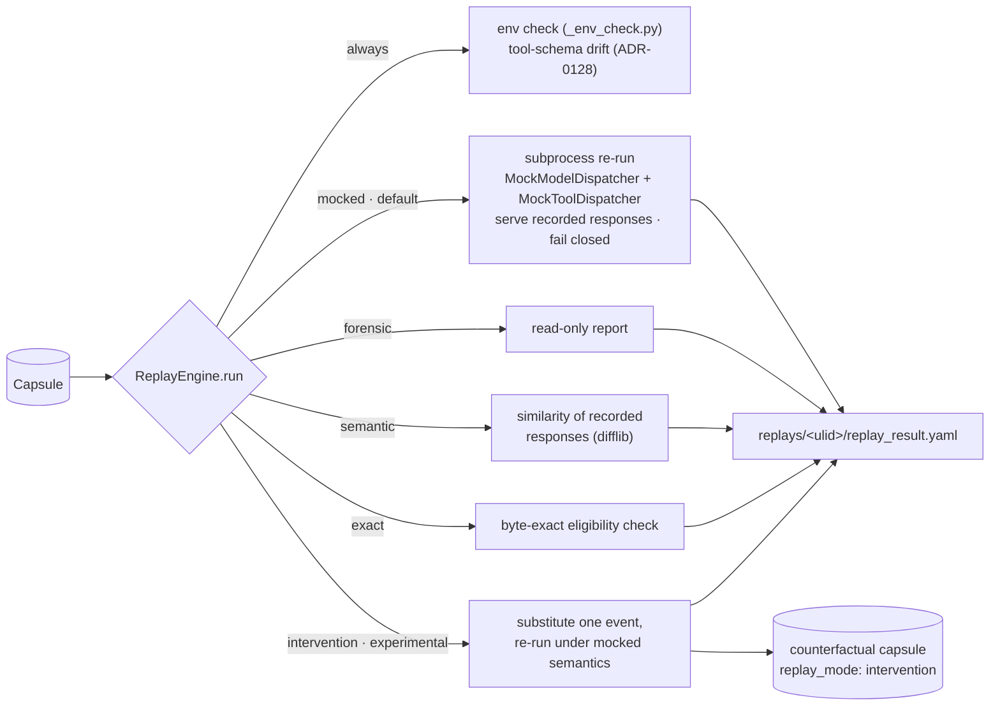

# Replay modes

[Architecture, as built](README.md) › Replay modes

`nova replay <capsule|run-id> --mode <mode>` (`cli/replay.py:replay_cmd`) loads a
capsule and passes it to `replay/_engine.py:ReplayEngine.run`. There are five
modes. Two of them, `mocked` and `intervention`, run the captured command again.
The other three read the capsule and execute nothing.

## What every mode does first

Before it branches, `ReplayEngine.run`:

- loads `capsule.yaml`, `replay.yaml`, `env.lock`, `model-calls.jsonl` and
  `tool-calls.jsonl`;
- compares the recorded environment with the current one
  (`replay/_env_check.py:EnvironmentResolver`) and records any differences as
  `env_warnings`;
- re-validates each recorded tool call against its **current** declared schema
  (`capture/schema_validation.py:revalidate_tool_calls`, ADR-0128) and records
  any drift. Only `exact` mode refuses on drift.
- if `--allow-mutating` is passed, evaluates the `replay_mutating` policy and
  writes the decision to the audit log.

Every mode writes `replay_result.yaml` (`replay/_result.py:write_replay_result`,
`schemas/replay-result.schema.json`) under `.novafabric/replays/<ulid>/` in the
current directory, or under `-o <dir>`.

## The modes

| Mode | Executes the command? | What it does | Maturity |
|---|---|---|---|
| `mocked` (default) | **Yes**, in a subprocess, with a 600 s timeout | Re-runs `capsule.yaml:command`. A `sitecustomize.py` installs `replay/_dispatcher.py:MockModelDispatcher` (recorded responses for the supported model surfaces, one queue per provider) and `MockToolDispatcher` (recorded MCP `ClientSession.call_tool` results, matched one-to-one). **Fail-closed** on divergence; `--permissive` only reports. Tools on other surfaces run live. See [the mocked-replay contract](#the-mocked-replay-contract-adr-0300) and the [support matrix](#support-matrix). | works today (Python workloads, supported surfaces only) |
| `forensic` | No | Read-only inspection. Reports call counts, environment warnings and schema drift. | works today |
| `semantic` | No | Scores how similar the recorded model responses within the capsule are to one another: the mean pairwise `difflib.SequenceMatcher` ratio, from 0.0 to 1.0. This is a **text** similarity, not a judgment of meaning, and no live model is called. | works today |
| `exact` | No | An **eligibility check** for byte-exact replay. It requires `env.lock` mode `deterministic` and a `gen_ai.request.seed` on every model call, and refuses if there is any tool-schema drift. Reports `exact_eligible` and `exact_reasons`. | works today |
| `intervention` | **Yes**, under mocked semantics | Needs `--intervention-file spec.yaml`. Substitutes one recorded model or tool event as the `InterventionSpec` describes (`replay/_intervention.py`), re-runs everything downstream with zero live model calls, and writes a minimal counterfactual capsule (`capsule.yaml` with `replay_mode: intervention` and `replay_of_run_id`, plus the call streams), so you can `nova diff` it against the original. | experimental (ADR-0086) |

## The mocked-replay contract (ADR-0300)

`replay/_contract.py` is the one place that decides what the dispatchers may
serve and how a replay is summarised; the engine and the in-process dispatchers
both use it.

**What is served.** A recorded model call is servable when its `gen_ai.system`
is `openai` or `anthropic`, its `status` is `success`, and it has at least one
recorded choice. (Every SDK call is also recorded once more by the `httpx` wire
hook, with no choices; that duplicate is never served.) A recorded tool call is
servable when it is an MCP `tools/call` with a tool name; a call captured both by
the in-process MCP hook and by `nova mcp-proxy` counts once.

**How tool calls are matched** (`ToolCallMatcher`), one-to-one: by an exact
`tool_call_id` when the surface carries one (MCP `call_tool` does not); else by
tool name plus an order-insensitive hash of the arguments, earliest unconsumed
record first — so repeated identical calls get distinct recorded results in
recorded order. A record is never served twice. Anything else is **unmatched**.

**Divergence policy.** Under the default `fail` policy the replayed process
raises a named `ReplayDivergenceError` subclass (`replay/_errors.py`) at the call
that diverged, instead of fabricating a reply or reaching the network:

| Divergence kind | When |
|---|---|
| `model_queue_exhausted` | more calls to a provider than were recorded (`provider`, `call_index`, `recorded_queue_length` reported) |
| `provider_mismatch` | the same, while another provider's recordings are unconsumed |
| `order_mismatch` | a call reaches a different provider than the recording did at that position |
| `unsupported_surface` | async client, `stream=True`, `messages.stream`, Responses API, `chat.completions.parse`, legacy completions |
| `malformed_recorded_response` | a recorded tool-call entry has no `name` |
| `tool_call_unmatched` | an MCP `call_tool` with no unconsumed recorded result — **the live tool is not run** |
| `model_calls_unconsumed` / `tool_calls_unconsumed` | (after the run) recorded responses that were never requested |
| `dispatcher_install_failed`, `multiple_interpreters` | the dispatcher could not be installed (the process is stopped, exit 86, before the workload runs), or several Python processes each consumed the queue |

Any divergence makes the result `status: failure` with `error.type:
ReplayDivergence` and a `divergence_reason` — even when the workload caught the
exception and exited 0, because the engine reads the dispatchers' event log, not
just the exit code. `--permissive` (`ReplayFlags(permissive=True)`) switches to
the `warn` policy: an exhausted queue serves an empty reply with a warning (the
pre-ADR-0300 behaviour), unsupported surfaces and unmatched MCP calls run live,
and every divergence is still recorded. `intervention` always uses `warn` and
installs no tool dispatcher, because a counterfactual is expected to diverge.

**What the result reports** (`replay_result.yaml`, additive and optional):

| Field | Meaning |
|---|---|
| `model_calls_mocked` / `model_calls_available` | recorded responses actually served / servable |
| `model_calls_unmatched` | calls with no recorded answer (including refused unsupported surfaces) |
| `tool_calls_mocked` / `tool_calls_available` / `tool_calls_recorded` | MCP results served / MCP results servable / every recorded tool call |
| `tool_calls_live` / `tool_calls_unmatched` | MCP calls run live (`--permissive` only) / MCP calls with no recorded result |
| `queues_fully_consumed` | every servable recording was requested |
| `divergence_reason` | the first divergence, plus a count of the others |
| `replay_contract` | policy, intercepted surfaces, `dispatcher_installed`, `model_calls_live`, unconsumed counts, `tool_calls_not_interceptable`, and the divergence list |

`nova replay` prints the served counts and the divergence reason under the
"Replay written" line.

## Support matrix

Populated from the code and the tests named in the last column (2026-10-08).
"Refused" means strict mocked replay raises `ReplayUnsupportedSurfaceError`
instead of letting the call reach the network; with `--permissive` it runs live
and is counted in `replay_contract.model_calls_live`.

| Provider / API surface | Capture | Mocked replay | Streaming | Async | Status | Evidence |
|---|---|---|---|---|---|---|
| OpenAI Chat Completions `create`, sync | SDK hook: full response incl. `tool_calls` | **Served** | `stream=True` refused | n/a | works today | `test_tool_choice_round_trip_e2e.py`, `test_mocked_replay_contract.py` (s1–s3, s9–s10) |
| OpenAI Chat Completions `create`, async | wire hook: request only, no response | Refused | refused | refused | unsupported | `test_mocked_replay_contract.py::test_s17_*` |
| OpenAI Chat Completions `parse` (sync/async) | wire hook: request only | Refused | — | refused | unsupported | code: `UNSUPPORTED_MODEL_SURFACES` |
| OpenAI Responses API (sync/async) | wire hook: request only | Refused | refused | refused | unsupported | `test_s17_unsupported_model_surfaces_are_refused` (sync); async: code |
| OpenAI legacy `completions.create` | wire hook: request only | Refused | — | refused | unsupported | code |
| Anthropic Messages `create`, sync | SDK hook: full response incl. `tool_use`; finish reason mapped to the schema enum, raw value kept | **Served**, raw `stop_reason` served back | `stream=True` and `messages.stream` refused | n/a | works today (tested against a stand-in `anthropic` package; the real SDK is not a dependency) | `test_tool_choice_round_trip_e2e.py`, `test_replay_tool_call_requests.py` |
| Anthropic Messages, async | wire hook: request only | Refused | refused | refused | unsupported | code |
| Non-Python clients via `nova api-proxy` | streaming: merged response, canonical `tool_calls`; non-streaming: request + id/model only | Not intercepted (replay patches Python SDKs) | — | — | capture only | `tests/test_api_proxy.py` |
| Other providers' SDKs, raw HTTP to a model API | wire hook: request only | Not intercepted — **live** | — | — | not controlled | — |
| MCP `ClientSession.call_tool` (in-process hook or `nova mcp-proxy`) | full result (proxy: verbatim JSON-RPC envelope) | **Served** one-to-one; unmatched refused | — | (async by nature) | works today | `test_mocked_replay_contract.py` (s2–s5, s8, s12–s13) |
| MCP session set-up (server start, `initialize`, `list_tools`) | not recorded as tool calls | Not intercepted — **live** | — | — | not controlled | e2e tests start a real in-memory MCP server during replay |
| HTTP, shell, filesystem, framework-native tools | network/file events, not tool records | Not intercepted — **live** | — | — | not controlled | `test_s13_network_tool_refused_and_uncontrolled_transports_reported` |

### What replay does not do today

These limits are stated so you can rely on the parts that do work:

- **Only the surfaces above are controlled.** If a workload's other tools have
  side effects (files, HTTP, databases, shell), a mocked replay repeats them.
  Run replays in a sandbox or against test credentials. The `--allow-readonly`,
  `--allow-mutating`, `--allow-external-side-effects` and
  `--allow-unknown-mutation` flags are evaluated by
  `replay/_policy.py:PolicyEvaluator`. Their per-call decisions are shown by
  `--dry-run` (which marks non-intercepted tools `[LIVE]`), but they do not
  intercept calls inside a mocked subprocess.
- **Async and streaming model calls cannot be served**, because capture records
  no response for them; they are refused, not silently sent to the network.
- **Model requests are not compared.** Responses are served by position per
  provider; a changed prompt with the same call count and order is not a
  divergence here. Use `nova diff` against a fresh capture.
- **MCP results recorded by the in-process hook are lossy** for non-text content
  (image `mimeType`, embedded resources, `structuredContent` are not recorded);
  `nova mcp-proxy` records the verbatim envelope.
- **A recorded argument that capture redacted cannot match** a replayed call
  carrying the real value; it fails closed as unmatched.
- **Replays do not write lineage edges.** Only `intervention` produces a capsule.
  Its `replay_of_run_id` becomes a `replayed_from` edge when that capsule is
  indexed.
- **No record-versus-replay output comparison runs automatically.** The signals
  are the subprocess exit code and status, environment warnings, schema drift,
  and, for `intervention`, its own checks. To compare the outputs of two runs,
  use `nova diff`.

## Related commands

| Command | Purpose | Maturity |
|---|---|---|
| `nova replay --dry-run` | Shows what would run, with the policy decision for each recorded tool call | works today |
| `nova replay-equivalence` | Compares two tool-call trajectories (`set`, `ordered` or `edit` match) and labels each divergence `dropped`, `added` or `changed` (`replay/equivalence/`) | experimental |
| `nova session replay` | Replays the members of a session in sequence | experimental |
| `nova evidence attest-replay` | Replays the run and writes a signed re-performance attestation | experimental |

## Read next

- [The lineage graph](lineage-graph.md): how `replayed_from` edges link runs.
- [Concepts › Replay Modes](../concepts.md#replay-modes)
