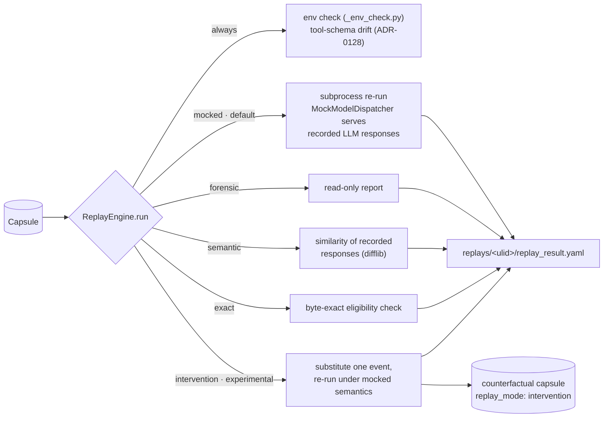

# Replay modes

[Architecture, as built](README.md) › Replay modes

`nova replay <capsule|run-id> --mode <mode>` (`cli/replay.py:replay_cmd`) loads a
capsule and passes it to `replay/_engine.py:ReplayEngine.run`. There are five
modes. Two of them, `mocked` and `intervention`, run the captured command again.
The other three read the capsule and execute nothing.

## What every mode does first

Before it branches, `ReplayEngine.run`:

- loads `capsule.yaml`, `replay.yaml`, `env.lock`, `model-calls.jsonl` and
  `tool-calls.jsonl`;
- compares the recorded environment with the current one
  (`replay/_env_check.py:EnvironmentResolver`) and records any differences as
  `env_warnings`;
- re-validates each recorded tool call against its **current** declared schema
  (`capture/schema_validation.py:revalidate_tool_calls`, ADR-0128) and records
  any drift. Only `exact` mode refuses on drift.
- if `--allow-mutating` is passed, evaluates the `replay_mutating` policy and
  writes the decision to the audit log.

Every mode writes `replay_result.yaml` (`replay/_result.py:write_replay_result`,
`schemas/replay-result.schema.json`) under `.novafabric/replays/<ulid>/` in the
current directory, or under `-o <dir>`.

## The modes

| Mode | Executes the command? | What it does | Maturity |
|---|---|---|---|
| `mocked` (default) | **Yes**, in a subprocess, with a 600 s timeout | Re-runs `capsule.yaml:command`. A `sitecustomize.py` installs `replay/_dispatcher.py:MockModelDispatcher`, which patches the OpenAI and Anthropic client methods to return the recorded responses in order, with one queue per provider. **Tool calls are not substituted.** The workload's tools run as they would normally, and `tool_calls_mocked` is reported truthfully as `0` (ADR-0261). | works today |
| `forensic` | No | Read-only inspection. Reports call counts, environment warnings and schema drift. | works today |
| `semantic` | No | Scores how similar the recorded model responses within the capsule are to one another: the mean pairwise `difflib.SequenceMatcher` ratio, from 0.0 to 1.0. This is a **text** similarity, not a judgment of meaning, and no live model is called. | works today |
| `exact` | No | An **eligibility check** for byte-exact replay. It requires `env.lock` mode `deterministic` and a `gen_ai.request.seed` on every model call, and refuses if there is any tool-schema drift. Reports `exact_eligible` and `exact_reasons`. | works today |
| `intervention` | **Yes**, under mocked semantics | Needs `--intervention-file spec.yaml`. Substitutes one recorded model or tool event as the `InterventionSpec` describes (`replay/_intervention.py`), re-runs everything downstream with zero live model calls, and writes a minimal counterfactual capsule (`capsule.yaml` with `replay_mode: intervention` and `replay_of_run_id`, plus the call streams), so you can `nova diff` it against the original. | experimental (ADR-0086) |

### What replay does not do today

These limits are stated so you can rely on the parts that do work:

- **`mocked` serves model responses, not tool responses.** If a workload's tools
  have side effects (files, HTTP, databases), a mocked replay repeats them. Run
  replays in a sandbox or against test credentials. The `--allow-readonly`,
  `--allow-mutating`, `--allow-external-side-effects` and
  `--allow-unknown-mutation` flags are evaluated by
  `replay/_policy.py:PolicyEvaluator`. Their per-call decisions are shown by
  `--dry-run`, but they do not intercept tool calls inside a mocked subprocess.
- **Only OpenAI `Completions.create` and Anthropic `Messages.create` are
  substituted** by the mock dispatcher. A call through another client goes to
  the network as usual.
- **Replays do not write lineage edges.** Only `intervention` produces a capsule.
  Its `replay_of_run_id` becomes a `replayed_from` edge when that capsule is
  indexed.
- **No record-versus-replay output comparison runs automatically.** The signals
  are the subprocess exit code and status, environment warnings, schema drift,
  and, for `intervention`, its own checks. To compare the outputs of two runs,
  use `nova diff`.

## Related commands

| Command | Purpose | Maturity |
|---|---|---|
| `nova replay --dry-run` | Shows what would run, with the policy decision for each recorded tool call | works today |
| `nova replay-equivalence` | Compares two tool-call trajectories (`set`, `ordered` or `edit` match) and labels each divergence `dropped`, `added` or `changed` (`replay/equivalence/`) | experimental |
| `nova session replay` | Replays the members of a session in sequence | experimental |
| `nova evidence attest-replay` | Replays the run and writes a signed re-performance attestation | experimental |

## Read next

- [The lineage graph](lineage-graph.md): how `replayed_from` edges link runs.
- [Concepts › Replay Modes](../concepts.md#replay-modes)
