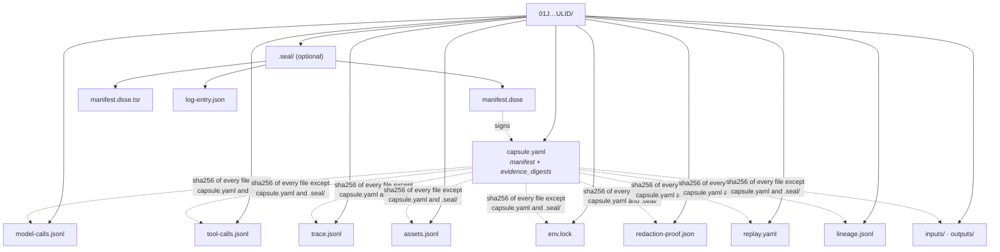

# Run Capsule anatomy

[Architecture, as built](README.md) › Run Capsule

A Run Capsule is a plain directory named by a ULID. It holds every observable
fact about one execution. You can copy it, archive it, attach it to a ticket or
verify it without a server, an account or a database.

**Maturity:** works today. The on-disk format is validated against
`schemas/run-capsule.schema.json`. It is not frozen until the v1.0 schema
freeze, but changes are additive and optional, so older capsules stay valid.

## Where capsules live

| Setting | Default | Resolved by |
|---|---|---|
| `NOVAFABRIC_CAPSULE_DIR` | — | `_paths.py:default_capsule_dir` |
| `NOVAFABRIC_HOME` | `~/.novafabric` | `_paths.py:nova_home` |
| Effective capsule root | `$NOVAFABRIC_HOME/capsules/` | |
| Per-run override | `nova capture -o <dir>` | `cli/capture.py` |

The run ID is a 26-character [ULID](https://github.com/ulid/spec)
(`capture/_ulid.py`; schema `$defs/Ulid`). ULIDs sort by creation time, so a
directory listing is already in chronological order.

## The files, in write order

`CaptureOrchestrator.run` in `capture/orchestrator.py` writes the files in this
order. A failed run gets the same set of files.

| # | Path | Holds | Written by |
|---|---|---|---|
| 1 | `inputs/`, `outputs/` | Inputs, and the workload's outputs | `capture/capsule.py:CapsuleWriter.open` |
| 1 | `model-calls.jsonl` | One record per LLM call, keyed with OTel GenAI attributes (`gen_ai.request.*`, `gen_ai.response.*`) | hooks, through `CapsuleWriter` |
| 1 | `tool-calls.jsonl` | One record per tool invocation | hooks, through `CapsuleWriter` |
| 1 | `trace.jsonl` | Execution spans, including the root span | hooks and orchestrator |
| 1 | `assets.jsonl` | References to registry assets the run consumed | hooks, through `CapsuleWriter` |
| 2 | `outputs/stdout.txt`, `outputs/stderr.txt` | Process output | orchestrator |
| 2 | `outputs/<sha>.<ext>` | Media blobs, content-addressed | `capture/media.py` |
| 3 | `env.lock` | Environment snapshot: `mode` (`deterministic` or `best-effort`), host, Python interpreter, installed packages | `capture/env.py:capture_environment` |
| 4 | `redaction-proof.json` | The secret-scan proof (see below) | `capture/secrets.py:SecretScannerV0` |
| 5 | `replay.yaml` | Replay policy (`schemas/replay-policy.schema.json`); capture writes a minimal policy, which you can extend | `capture/replay.py:minimal_replay_policy` |
| 6 | `capsule.yaml` | The run manifest | orchestrator |
| 7 | `lineage.jsonl` | Typed lineage edges for this run | `lineage/_writer.py:LineageWriter` |
| 8 | `capsule.yaml` (rewritten) | The manifest again, now with `evidence_digests` | orchestrator, `_evidence_digests` |
| 9 | `.seal/manifest.dsse`, `.seal/manifest.dsse.tsr`, `.seal/log-entry.json` | The seal, only when NovaSeal is configured | orchestrator, `_seal_capsule` |

These files appear only in some runs:

| Path | When |
|---|---|
| `network_events.jsonl`, `file_events.jsonl`, `human_approvals.jsonl` | When the event stream has at least one record (`capture/event_recorder.py`) |
| `capture-health.json` | When the recorder had to drop events. Its absence means nothing was dropped. |
| `c2pa-manifest.json` | `nova capture --mark-provenance` |
| `otel-genai-spans.json` | `nova capture --emit-otel-genai` |

## The manifest: `capsule.yaml`

The schema requires `schema_version`, `run_id`, `created_at`, `finished_at`,
`duration_ms`, `status`, `command`, `capture_mode`, `novafabric_version`,
`working_directory`, `host`, the `*_ref` pointers to the files above,
`trace_root_span_id`, `inputs`, `outputs`, and the call counters
(`model_call_count`, `tool_call_count`, `mutating_tool_count`).

Some optional fields matter for the architecture:

| Field | Purpose |
|---|---|
| `evidence_digests` | `{path: {sha256, size_bytes}}` for every file except `capsule.yaml` and `.seal/`. This field is what binds the whole directory to the seal. |
| `parent_run_id`, `replay_of_run_id`, `replay_mode` | Relationships to other capsules. `replay_of_run_id` becomes a `replayed_from` lineage edge. |
| `session_id`, `sequence` | Membership in a multi-turn session (experimental) |
| `facets`, `extensions` | Additive extension points (`slurm`, `kubernetes`, …) that let the format grow without a new top-level format |
| `exit_code`, `error` | The failure record. A failed run is still a complete capsule. |

## The redaction proof: `redaction-proof.json`

The secret scanner runs on every capture. It scans and redacts, in place, the
free-text streams: `model-calls.jsonl`, `tool-calls.jsonl`, `trace.jsonl` and the
optional event streams (`capture/secrets.py:_SCAN_TARGETS`).
Its proof file records:

- the SHA-256 of each scanned file before and after redaction;
- for each finding: the rule ID, byte offset, length, redaction strategy, and the
  SHA-256 of the matched secret (never the secret itself);
- the hash of the rule pack, and a `chain_hash` over the canonical proof;
- `masker_findings[]` and `masker_errors[]` from the pluggable masking pipeline
  (`masking/`).

`redaction-proof.json` is listed in `evidence_digests`, so a seal covers the proof
along with everything else.

## Parent and child capsules (prototype)

Distributed runs, such as a SLURM job across several nodes, use a separate
writer, `capsule/writer.py:CapsuleWriter` with `ParentCapsuleTracker`. It records
one PARENT plus N WORKER capsules under a shared `global_run_id`, in a
`capsule.json` that follows `schemas/parent_child_capsule_v1.schema.json`.
`capsule/orphan.py` handles workers whose parent never finalised. The commands
are `nova run new-run-id | validate-distributed | show | lineage`
(`capsule/cli.py`).

> Two classes named `CapsuleWriter` exist: `capture/capsule.py` writes ordinary
> run capsules, and `capsule/writer.py` writes the distributed parent/child
> layout.

## Read next

- [Sealing and verification](sealing-and-verification.md): how `evidence_digests`
  becomes a signature.
- [Concepts › Run Capsule](../concepts.md#run-capsule)
