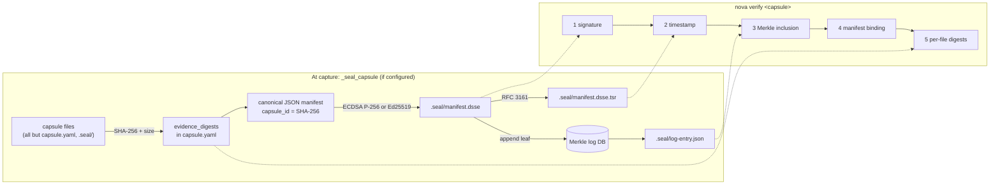

# Sealing and verification

[Architecture, as built](README.md) › Sealing and verification

A capsule is tamper-evident once it is sealed. NovaFabric has two independent
mechanisms:

1. **The NovaSeal capsule seal** (experimental). It is written into `.seal/` at
   the end of capture and checked with `nova verify <capsule>`.
2. **The Evidence Bundle** (works today). This is a ZIP with Ed25519-signed
   in-toto DSSE attestations, built by `nova export-evidence` and meant to be
   handed to a third party.

Both rest on SHA-256 and canonical JSON, and both cover the redaction proof.

## Turning sealing on

Sealing is **opt-in**. `trust/novaseal/config.py:load_signing_profile` looks for
`NOVAFABRIC_SEAL_CONFIG` and then for `~/.novafabric/novaseal.yaml`. If neither
exists, capture skips sealing. Sealing never blocks a capture: on any error,
`capture/orchestrator.py:_seal_capsule` prints a warning and the capsule is kept.

The key comes from one of four signing profiles: `local` (a PEM key on disk),
`aws_kms`, `azure_kv` or `gcp_kms`. The cloud profiles sign through a signing
backend, so the private key never leaves the KMS. See
[NovaSeal configuration](../novaseal-configuration.md) and
[key management](../novaseal-key-management.md).

## What gets signed

1. **Per-file digests.** `capture/orchestrator.py:_evidence_digests` hashes every
   file in the capsule except `capsule.yaml` (which carries the result) and
   `.seal/` (which does not exist yet). It records `sha256` and `size_bytes` for
   each, writes the map into the manifest as `evidence_digests`, and rewrites
   `capsule.yaml`.
2. **Canonical payload.** `trust/novaseal/__init__.py:NovaSeal.seal` serialises
   the manifest as sorted-key compact JSON. The **`capsule_id`** is the SHA-256 of
   those bytes.
3. **DSSE envelope.** `trust/novaseal/envelope.py:create_envelope` signs the
   payload with **ECDSA P-256 / SHA-256**. A local Ed25519 PEM key is also
   accepted. The payload type is `application/vnd.novafabric.capsule+json`, and
   each signature carries a `keyid` (SHA-256 of the signer certificate) and the
   certificate itself. The envelope is written to `.seal/manifest.dsse`.

Because `redaction-proof.json` is one of the digested files, the signature
covers the redaction proof. A capsule cannot be re-redacted after sealing without
breaking verification.

## RFC 3161 timestamp

`trust/novaseal/timestamp.py` and `trust/_rfc3161.py` request a timestamp token
over the envelope from a Time Stamping Authority and write it to
`.seal/manifest.dsse.tsr`.

| Setting | Behaviour |
|---|---|
| `tsa_url` omitted | The default TSA, `https://freetsa.org/tsr`, is used |
| `tsa_urls: [...]` | An ordered fallback list |
| `tsa_url: ""` | Timestamping is disabled |
| TSA unreachable | The seal still succeeds, with an empty `.tsr` and a warning |

To seal on a machine with no network, set `tsa_url: ""` or point it at an
internal TSA.

## The Merkle log

`trust/novaseal/merkle.py` keeps an **append-only log of seal events**. It is
not a tree over the files of one capsule.

- Each leaf is the canonical JSON of `{capsule_id, keyid, has_tsr}`. Key
  rotations are logged as leaves too.
- Hashing is SHA-256 with domain separation: `leaf = H(0x00 ‖ entry)` and
  `node = H(0x01 ‖ left ‖ right)`.
- The tree head is stored in a local SQLite database, by default
  `~/.novafabric/novaseal-merkle.db` (set with `merkle_db`). A Postgres backend
  is experimental.
- `.seal/log-entry.json` records `leaf_index`, `leaf_hash`, `root_hash`,
  `tree_size` and `entry` for this capsule.
- `nova seal log verify` checks the log, and `--consistency N` checks a
  consistency proof between tree sizes.

A second Merkle construction belongs to the Evidence Bundle.
`evidence/merkle.py:capsule_merkle_root` computes an RFC 6962-style root over
**all files** in a capsule. That root is the subject digest of the bundle's
in-toto statements (see below).

## Verification: `nova verify <capsule>`

`cli/verify.py:verify_cmd` reads the NovaSeal configuration and checks each layer
in turn:

| # | Check | Passes when |
|---|---|---|
| 1 | DSSE signature | The envelope signature verifies against the embedded certificate |
| 2 | RFC 3161 token | The token's status and message imprint match the envelope. If no token is present, the output says `NOT PRESENT` and the check passes, unless a TSA CA bundle is supplied. |
| 3 | Merkle inclusion | The entry in `log-entry.json` is included in the Merkle log database named by the configuration |
| 4 | Manifest binding | `capsule.yaml` on disk equals the signed payload, and `capsule_id` matches |
| 5 | Per-file digests | Every file listed in `evidence_digests` exists and matches its SHA-256. Extra files are listed but do not fail the check. |

The exit code is `0` when every check passes and `1` otherwise. Optional
hardening flags are experimental:

- `--ca-bundle` validates the signer certificate chain;
- `--crl-dir` and `--crl-strict` add offline revocation checks;
- `--tsa-ca-bundle` validates the TSA chain.

`nova verify` also accepts an Evidence Bundle `.zip` and recomputes every
artifact digest, and an `export-manifest.json` from a batch export.

**Where verification can run.** Checks 1, 2, 4 and 5 use only the capsule.
Check 3 needs the Merkle log database that recorded the seal, so a full
`nova verify` runs where that database is available: the sealing host, or a
host that shares the configured log. To give a capsule to a party that has no
access to that log, export an Evidence Bundle.

## Maker-checker signing (experimental)

`nova seal propose` (maker) and `nova seal approve` (checker) add a
separation-of-duties signature chain on top of the capsule seal. `nova seal verify`
checks that chain. `nova seal bypass` creates a time-limited, audited exception.
`nova seal ratchet` is an opt-in forward-secure per-node key ratchet. All of
these live in `cli/seal_propose.py`.

## The Evidence Bundle: verification without NovaFabric (works today)

`nova export-evidence <capsule> -o bundle.zip` runs
`evidence/bundle.py:EvidenceBundleBuilder`:

1. **Check the capsule.** The required files, including `redaction-proof.json`,
   and the `inputs/` and `outputs/` directories must exist. Otherwise the export
   is refused.
2. **Policy gate.** The export decision is recorded in the audit log.
3. **Stage the contents:** `run-capsule/`, `lineage-subgraph/edges.jsonl`,
   `schemas/` and a `README.md`.
4. **Sign attestations.** It writes in-toto Statement v1 envelopes
   (`attestations/run.intoto.json`, `redaction.intoto.json`,
   `lineage.intoto.json`), signed with Ed25519 (`evidence/intoto.py`), each with
   a matching signature and certificate. The run statement's subject is the
   capsule Merkle root.
5. **Write `manifest.json`** (`schemas/evidence-bundle.schema.json`). It carries
   a SHA-256 for every artifact and a plain-text verification recipe.

The recipe needs only a SHA-256 tool and an Ed25519 verifier:

1. Recompute the manifest hash.
2. Recompute each artifact's SHA-256.
3. Verify each DSSE envelope over its pre-authentication encoding.
4. Check that each statement's subject matches `subject.capsule_hash`.

Optional additions: `--timestamp` (an RFC 3161 token for the bundle), Rekor
publication when `NOVA_REKOR_URL` is set, and an outer DSSE envelope.

## Other trust surfaces

| Surface | Maturity | Where |
|---|---|---|
| Sigstore keyless signing, `nova seal sign --backend sigstore` and `nova verify --backend sigstore` | experimental, needs the `[sigstore]` extra | `cli/seal_propose.py`, `cli/verify.py` |
| Rekor transparency-log publication | opt-in (`NOVA_REKOR_URL`), best effort | `promote/rekor_client.py` |
| Witness cosigning of tree heads | experimental, library only | `trust/novaseal/witness.py` |
| PII redaction manifest under legal hold (`nova capture --legal-hold`) | experimental | `compliance/pii/manifest.py` |
| Signed subject-proof reports (`nova verify --check-redaction`) | experimental | `cli/redact.py` |

The roadmap and the [decisions index](../decisions.md) track which further
seal-layer capabilities are planned (for example, a dedicated network signing
service and post-quantum signatures). None of them is implemented.

## Read next

- [Prove a run to an auditor](../tutorials/prove-a-run-to-an-auditor.md) (tutorial)
- [NovaSeal stability](../novaseal-stability.md)
