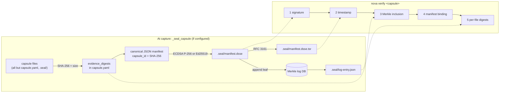

# Sealing and verification

[Architecture, as built](README.md) › Sealing and verification

A capsule is tamper-evident once it is sealed. NovaFabric has two independent
mechanisms:

1. **The NovaSeal capsule seal** (experimental). It is written into `.seal/` at
   the end of capture and checked with `nova verify <capsule>`.
2. **The Evidence Bundle** (works today). This is a ZIP with Ed25519-signed
   in-toto DSSE attestations, built by `nova export-evidence` and meant to be
   handed to a third party.

Both rest on SHA-256 and canonical JSON, and both cover the redaction proof.

## Turning sealing on

Sealing is **opt-in**. `trust/novaseal/config.py:load_signing_profile` looks for
`NOVAFABRIC_SEAL_CONFIG` and then for `~/.novafabric/novaseal.yaml`. If neither
exists, capture skips sealing. Sealing never blocks a capture: on any error,
`capture/orchestrator.py:_seal_capsule` prints a warning and the capsule is kept,
without `.seal/`. `create_envelope` refuses to sign with a key that does not match
the configured certificate, so a capture never writes a seal that cannot verify.

**First run (experimental, ADR-0301).** `nova init` does not configure sealing; it
offers `nova seal init` as a next step. That command
(`trust/novaseal/local_identity.py:init_local_identity`) creates a dedicated ECDSA
P-256 signing key, a local seal CA and a leaf certificate under
`keys/novaseal/` (private keys mode 600), and writes a managed `novaseal.yaml`
(`profile: local`, no `tsa_url`, so no network access). The identity is
**self-asserted**: a seal made with it proves that the holder of the key signed, not
who that holder is. `nova seal init --force` rotates the key under the same CA and
records a `key_rotation` entry in the Merkle log, so a verifier who pinned
`ca.crt.pem` keeps validating old and new capsules. A `novaseal.yaml` that
`nova seal init` did not write is never replaced.

The key comes from one of four signing profiles: `local` (a PEM key on disk),
`aws_kms`, `azure_kv` or `gcp_kms`. The cloud profiles sign through a signing
backend, so the private key never leaves the KMS. See
[NovaSeal configuration](../novaseal-configuration.md) and
[key management](../novaseal-key-management.md).

## What gets signed

1. **Per-file digests.** `capture/orchestrator.py:_evidence_digests` hashes every
   file in the capsule except `capsule.yaml` (which carries the result) and
   `.seal/` (which does not exist yet). It records `sha256` and `size_bytes` for
   each, writes the map into the manifest as `evidence_digests`, and rewrites
   `capsule.yaml`.
2. **Canonical payload.** `trust/novaseal/__init__.py:NovaSeal.seal` serialises
   the manifest as sorted-key compact JSON. The **`capsule_id`** is the SHA-256 of
   those bytes.
3. **DSSE envelope.** `trust/novaseal/envelope.py:create_envelope` signs the
   payload with **ECDSA P-256 / SHA-256**. A local Ed25519 PEM key is also
   accepted. The payload type is `application/vnd.novafabric.capsule+json`, and
   each signature carries a `keyid` (SHA-256 of the signer certificate) and the
   certificate itself. The envelope is written to `.seal/manifest.dsse`. The
   signature is computed over the standard DSSE v1 pre-authentication encoding,
   so stock DSSE verifiers accept it. Seals made by v0.102.x and earlier used a
   non-standard encoding; `nova verify` still accepts them and labels them
   **legacy envelope**.

Because `redaction-proof.json` is one of the digested files, the signature
covers the redaction proof. A capsule cannot be re-redacted after sealing without
breaking verification.

## RFC 3161 timestamp

`trust/novaseal/timestamp.py` and `trust/_rfc3161.py` request a timestamp token
over the envelope from a Time Stamping Authority and write it to
`.seal/manifest.dsse.tsr`.

Timestamping is **opt-in** (ADR-0292). There is no default TSA.

| Setting | Behaviour |
|---|---|
| `tsa_url` / `tsa_urls` omitted or empty | No timestamp and no network call; one warning per process |
| `tsa_url: <url>` | That TSA, and only that one, is contacted |
| `tsa_urls: [...]` | An ordered fallback list |
| TSA unreachable | The seal still succeeds, with an empty `.tsr` and a warning |

Through v0.102.x an omitted `tsa_url` meant `https://freetsa.org/tsr`; to keep
that behaviour, set it explicitly. The timestamp covers the signed envelope,
signature included, so it sits outside the signature by design; `nova verify`
checks that the token's message imprint matches this envelope.

## The Merkle log

`trust/novaseal/merkle.py` keeps an **append-only log of seal events**. It is
not a tree over the files of one capsule.

- Each leaf is the canonical JSON of `{capsule_id, keyid, has_tsr}`. Key
  rotations are logged as leaves too.
- Hashing is SHA-256 with domain separation: `leaf = H(0x00 ‖ entry)` and
  `node = H(0x01 ‖ left ‖ right)`.
- The tree head is stored in a local SQLite database, by default
  `~/.novafabric/novaseal-merkle.db` (set with `merkle_db`). A Postgres backend
  is experimental.
- `.seal/log-entry.json` records `leaf_index`, `leaf_hash`, `root_hash`,
  `tree_size` and `entry` for this capsule. New seals also carry the Merkle
  inclusion proof in this file, and the entry is bound to the sealed capsule.
- `nova seal log verify` checks the log, and `--consistency N` checks a
  consistency proof between tree sizes.

A second Merkle construction belongs to the Evidence Bundle.
`evidence/merkle.py:capsule_merkle_root` computes an RFC 6962-style root over
**all files** in a capsule. That root is the subject digest of the bundle's
in-toto statements (see below).

## Verification: `nova verify <capsule>`

`cli/verify.py:verify_cmd` reads the NovaSeal configuration and checks each layer
in turn:

| # | Check | Passes when |
|---|---|---|
| 1 | DSSE signature | The envelope signature verifies against the embedded certificate |
| 2 | RFC 3161 token | The token parses strictly, its status is granted and its message imprint matches this envelope. If no token is present, the output says `NOT PRESENT`, `timestamp_ok` is `None` (absent, not passed) and the seal stays valid, unless a TSA CA bundle is supplied. A token that cannot be parsed strictly is reported as a structural check only, never as OK. |
| 3 | Merkle inclusion | The proof carried in `log-entry.json` reproduces its root and the entry names this capsule. If a local log is configured, it is checked as well. |
| 4 | Manifest binding | `capsule.yaml` on disk equals the signed payload, and `capsule_id` matches |
| 5 | Per-file digests | Every file listed in `evidence_digests` exists and matches its SHA-256. Extra files are listed but do not fail the check. |

The exit code is `0` when every check passes and `1` otherwise. Optional
hardening flags are experimental:

- `--ca-bundle` validates the signer certificate chain (and raises the reported
  signer trust level, below);
- `--crl-dir` and `--crl-strict` add offline revocation checks;
- `--tsa-ca-bundle` validates the TSA chain.

`nova verify` also accepts an Evidence Bundle `.zip` and recomputes every
artifact digest, and an `export-manifest.json` from a batch export.

**Signer trust level (experimental, ADR-0301).** Besides the pass/fail checks,
`nova verify` reports what *the verifier* established about who signed, as
`identity_trust` in the text report, in `nova verify --json`, in
`VerificationResult` and in `POST /api/runs/{id}/verify`:

| `identity_trust` | Meaning | Claim it permits |
|---|---|---|
| `none` | no signature verified | nothing |
| `self-asserted` | signature verifies under the envelope's own certificate; nothing the verifier trusts vouches for it | "unchanged since signed by the holder of this key" |
| `local-ca-pinned` | `--ca-bundle` validated the chain to a `nova seal init` local CA | the above, plus continuity with that installation across key rotations |
| `ca-anchored` | `--ca-bundle` validated the chain to another CA | "signed by a key certified by that CA", at that CA's assurance |

The `O=NovaFabric local seal identity (self-asserted)` subject marker can only lower
a label, never raise it. Where a key lived (file, KMS, HSM) cannot be seen from a
capsule and is never claimed. A Sigstore trust level on `--backend sigstore` is
**planned**.

**Where verification can run.** Every check uses only the capsule, so
`nova verify` runs anywhere and never creates a log. The carried proof's root is
not independently anchored, and the output says so. For a capsule sealed by
v0.102.x or earlier, verified away from the sealer's log, check 3 prints
`NOT CHECKED — log not available` and does not fail.

## Maker-checker signing (experimental)

`nova seal propose` (maker) and `nova seal approve` (checker) add a
separation-of-duties signature chain on top of the capsule seal. `nova seal verify`
checks that chain. `nova seal bypass` creates a time-limited, audited exception.
`nova seal ratchet` is an opt-in forward-secure per-node key ratchet. All of
these live in `cli/seal_propose.py`.

## The Evidence Bundle: verification without NovaFabric (works today)

`nova export-evidence <capsule> -o bundle.zip` runs
`evidence/bundle.py:EvidenceBundleBuilder`:

1. **Check the capsule.** The required files, including `redaction-proof.json`,
   and the `inputs/` and `outputs/` directories must exist. Otherwise the export
   is refused.
2. **Policy gate.** The export decision is recorded in the audit log.
3. **Stage the contents:** `run-capsule/`, `lineage-subgraph/edges.jsonl`,
   `schemas/` and a `README.md`.
4. **Sign attestations.** It writes in-toto Statement v1 envelopes
   (`attestations/run.intoto.json`, `redaction.intoto.json`,
   `lineage.intoto.json`), signed with Ed25519 (`evidence/intoto.py`), each with
   a matching signature and public key. The run statement's subject is the
   capsule Merkle root.
5. **Write `manifest.json`** (`schemas/evidence-bundle.schema.json`). It carries
   a SHA-256 for every artifact and a plain-text verification recipe.

### What is in the bundle

This is the one authoritative list; other pages summarise it and link here.
`tests/docs/test_evidence_bundle_contents.py` builds a real bundle and checks the list
against the ZIP.

| Entry | What it is |
|---|---|
| `run-capsule/` | A copy of the whole capsule directory: `capsule.yaml`, the record streams, `env.lock`, `redaction-proof.json` (the secret-scan record), `inputs/`, `outputs/` and, when the capsule was sealed at capture, `.seal/` |
| `lineage-subgraph/edges.jsonl` | The capsule's lineage edges (empty when it recorded none) |
| `schemas/` | The JSON Schemas shipped with the exporting `novafabric` version |
| `attestations/` | Ed25519-signed in-toto Statement v1 DSSE envelopes: `run` (subject: the capsule Merkle root), `redaction` (subject: the redaction proof's chain hash), `lineage`, and `energy` when the capsule has `energy-receipts.jsonl` (experimental, ADR-0093) |
| `signatures/` | Each envelope's raw signature (`.sig`) and the signer's public key (`.cert`, PEM) |
| `manifest.json` | SHA-256 and size of every other file, the attestation and signature index, `subject.capsule_hash`, the verification recipe and `manifest_hash`; with `--with-custody`, the chain-of-custody blocks (experimental, ADR-0095) |
| `README.md` | The verification recipe in plain text |
| `manifest.dsse.tsr` | Only with `--timestamp`: an RFC 3161 token over `attestations/run.intoto.json` |

`--dsse` writes `<bundle>.dsse.json` **next to** the ZIP, not inside it.

The recipe needs only a SHA-256 tool and an Ed25519 verifier:

1. Recompute the manifest hash.
2. Recompute each artifact's SHA-256.
3. Verify each DSSE envelope over its pre-authentication encoding.
4. Check that each statement's subject matches `subject.capsule_hash`.

Optional additions: `--timestamp` (an RFC 3161 token for the bundle), Rekor
publication when `NOVA_REKOR_URL` is set, and an outer DSSE envelope.

## Other trust surfaces

| Surface | Maturity | Where |
|---|---|---|
| Sigstore keyless signing, `nova seal sign --backend sigstore` and `nova verify --backend sigstore` | experimental, needs the `[sigstore]` extra | `cli/seal_propose.py`, `cli/verify.py` |
| Rekor transparency-log publication | opt-in (`NOVA_REKOR_URL`), best effort | `promote/rekor_client.py` |
| Witness cosigning of tree heads | experimental, library only | `trust/novaseal/witness.py` |
| PII redaction manifest (`RedactionManifest`, with its `legal_hold_mode` field; there is no capture flag for it) | experimental, library only | `compliance/pii/manifest.py` |
| Signed subject-proof reports (`nova verify --check-redaction`) | experimental | `cli/redact.py` |

The roadmap and the [decisions index](../decisions.md) track which further
seal-layer capabilities are planned (for example, a dedicated network signing
service and post-quantum signatures). None of them is implemented.

## Read next

- [Prove a run to an auditor](../tutorials/prove-a-run-to-an-auditor.md) (tutorial)
- [NovaSeal stability](../novaseal-stability.md)
