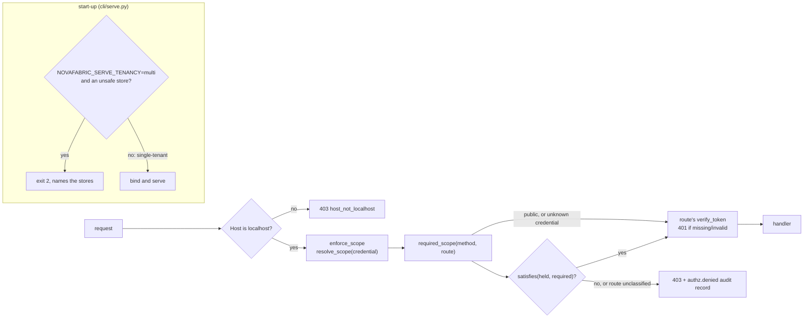

# The `nova serve` request path

[Architecture, as built](README.md) › `nova serve` request path

`nova serve` is the local dashboard and its `/api/*` routes. This page follows
one HTTP request from the socket to the handler and names every place it can be
refused. Three decisions shape the path:

- **ADR-0228, authorization** (experimental): every route has a required scope
  in one table, and a route missing from the table is denied to everyone.
- **ADR-0229, tenancy posture** (experimental): `serve` refuses to start in
  multi-tenant mode while any store it reads cannot filter by tenant.
- **ADR-0231, audit enrichment** (experimental): each 403 from the scope check
  writes one audit record that says how well it knows the actor.

## Step by step

| # | What happens | Code | Status |
|---|---|---|---|
| 1 | At start-up, before the token is minted or a socket is bound, `assert_multi_tenant_ready` reads `NOVAFABRIC_SERVE_TENANCY`. Anything but `multi` means single-tenant, the default. In `multi` mode, any store classed `unsafe` stops the process with exit code 2 and a message naming each store and why. | `cli/serve.py`, `serve/tenancy.py:assert_multi_tenant_ready` | experimental |
| 2 | The `host_header_guard` middleware rejects a `Host` header other than `localhost`, `127.0.0.1` or `[::1]` with 403 `host_not_localhost`. It runs before any dependency, so no scope check and no audit record happen. This is the DNS-rebinding defence. | `serve/app.py:host_header_guard`, `serve/auth.py:is_localhost_host` | works today |
| 3 | `enforce_scope` is one dependency mounted on the whole app, so routers added later inherit it. It reads the credential (`Authorization: Bearer`, else `?token=`) and maps it: the server's `.serve-token` holds `admin`; a token issued by `POST /api/admin/tokens` holds the scope it was minted with; a token issued before scopes existed reads as `admin`. | `serve/authz.py:build_authz_dependency`, `resolve_scope` | experimental |
| 4 | `required_scope` looks up `(method, route template)` in `ROUTE_SCOPES`. A `public` route passes. A credential the server does not recognise also passes this step, so that the route's own `verify_token` answers **401** rather than a 403 that would reveal the route exists. | `serve/authz.py:required_scope`, `ROUTE_SCOPES` | experimental |
| 5 | `satisfies(held, required)` decides. If it fails, or the route has no entry in the table, the answer is **403**, and one `authz.denied` record is appended to the dashboard audit log. | `serve/authz.py:satisfies`, `_audit_denial`, `serve/audit.py:append` | experimental |
| 6 | Otherwise the route's own `verify_token` dependency checks the credential again (401 if missing or invalid) and the handler runs. | `serve/app.py:verify_token` | works today |

WebSocket routes (`/api/tv5/ws`, `/topology/stream`) are skipped by
`enforce_scope` and keep their inline host and token checks. Scope on a
long-lived subscription is still an open question (ADR-0228 OQ-2).

## The scope rules

| Held | Satisfies |
|---|---|
| `admin` | every scope, including `audit` |
| `operate` | `operate`, `read` |
| `read` | `read` |
| `audit` | `audit`, `read`, and **nothing else** |
| any | a `public` route |

`public` is a property of a route, never of a credential: `parse_scope` cannot
produce it. An unrecognised scope string in a stored token record falls back to
the caller's default (`admin` for legacy records) with a warning, so a
hand-edited token file cannot take the server down.

**Unclassified means denied.** A route missing from `ROUTE_SCOPES` gets 403 even
with the server token (ADR-0228 D3). A forgotten classification then breaks a
feature loudly instead of disclosing evidence quietly. A CI guard fails on the
first unclassified route.

## The audit record for a 403

`_audit_denial` writes to `$NOVAFABRIC_HOME/dashboard-audit.jsonl` (override:
`NOVAFABRIC_DASHBOARD_AUDIT_FILE`):

| Field | Value |
|---|---|
| `action` | `authz.denied` |
| `required_scope` / `held_scope` | top-level fields, `unclassified` when the route has no entry |
| `resource` | `"<METHOD> <route template>"` |
| `identity_source` | `shared-token` for the one `.serve-token`; `credential` for an issued token |
| actor ID | omitted for `shared-token`, the token fingerprint for `credential` |

The record never contains the presented secret. A 401 writes nothing, because a
401 is usually a stale browser tab. If writing the record fails, the failure is
logged and the 403 still stands: an audit failure never grants access.

## The tenancy posture

Each store in the `serve` read path declares one of three classes in
`STORE_TENANCY`, and a test re-checks each claim against the store's real schema:

| Class | Stores |
|---|---|
| `aware` (can answer "only tenant X's rows") | `metadata_store`, `evidence_fabric`, `cost_store`, `object_capsule_store` |
| `agnostic` (isolated by the deployment) | `capsule_dir` |
| `unsafe` (would mix tenants) | `runs_cache`, `knowledge_graph`, `lineage_store` |

Because three stores are unsafe, including the runs index behind `/api/runs`,
multi-tenant `serve` is refused at start-up rather than served with some panels
scoped and others not. `GET /api/doctor` reports the posture in both modes under
the `tenancy_posture` check. For multi-tenant deployments, use `nova server`
(see [Server data plane](server-data-plane.md)).

## Not implemented yet

- Per-request tenant selection. `serve/tenancy.py:select_tenant` exists and is
  unit-tested, but no route calls it. **planned**, once `runs_cache` gains a
  tenant column (ADR-0229 OQ-1).
- Roles written through `POST /api/admin/roles` are not read back as scopes in
  `serve`. That endpoint is `admin`-gated.
- Scope on WebSocket subscriptions (ADR-0228 OQ-2).

## Read next

- [Dashboard security model](../dashboard.md) (minting a narrower token)
- [OTLP ingest](otlp-ingest.md): two `operate` routes on this path
- [Deployment topologies](deployment-topologies.md)
