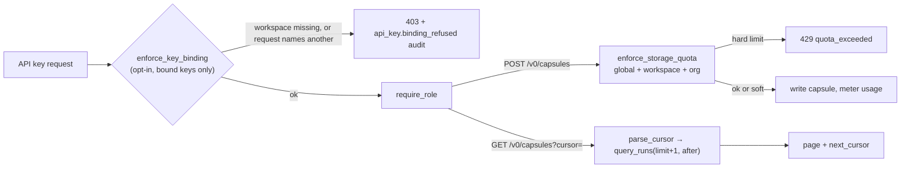

# Server data plane

[Architecture, as built](README.md) › Server data plane

This page covers three paths through the multi-user REST API (`nova server`,
the `/v0` routes). All three are **experimental**, and the first two are **off
by default**.

| Path | Decision | Default |
|---|---|---|
| API-key workspace-binding enforcement | ADR-0294 D2 | off (`api_keys.enforce_workspace_binding`) |
| Per-org budgets, with global and workspace budgets | ADR-0294 D1, ADR-0208, ADR-0179 | inert unless `rate_limits.enabled` and a non-zero limit are configured |
| Keyset pagination of list routes | ADR-0206 | on for `GET /v0/capsules` and `GET /v0/lineage/nodes`; legacy offset cursors still served |

## Admission: API-key workspace binding

An API key (ADR-0193) may carry a workspace binding (ADR-0178). Before
ADR-0294 the binding was attribution only: it decided which workspace a request
was *metered* to. With `api_keys.enforce_workspace_binding` on (env
`NOVAFABRIC_SERVER_API_KEYS_ENFORCE_WORKSPACE_BINDING`), `enforce_key_binding`
runs after the key is resolved and refuses with **403**:

| Code | When |
|---|---|
| `workspace_binding_invalid` | The bound workspace does not exist, or the workspace store cannot be read (fails closed). |
| `workspace_binding_mismatch` | The request names a different workspace, in the `X-NovaFabric-Workspace` header or the `workspace` query parameter. `details` carries `binding`, `requested` and `source`. |

Unbound keys and non-key credentials are untouched. Each refusal is written to the
audit log as `api_key.binding_refused`, with references only and never the key,
at most once per (subject, reason, requested workspace) per 60 seconds, so a
misconfigured client cannot flood the log.

**What this is not.** The binding limits which workspace a key may *name*. It does
not narrow list results: the capsule store is not partitioned by workspace
(ADR-0178), so a bound key listing capsules still sees every capsule its role
allows.

Code: `server/key_binding.py:enforce_key_binding`, called from `server/auth.py`.

## Upload: budgets

`POST /v0/capsules` and the score-submission route carry the
`enforce_storage_quota` dependency. It evaluates every installed checker
and the strictest outcome wins:

| Checker | Scope | Configured under |
|---|---|---|
| `QuotaChecker` | the whole deployment (ADR-0179) | `rate_limits.quota` |
| `WorkspaceQuotaChecker` | one workspace's metered counters (ADR-0208) | `rate_limits.quota.workspaces` |
| `OrgQuotaChecker` | the sum over every workspace in the org (ADR-0294) | `rate_limits.quota.orgs` |

- **Soft limit**: the write succeeds, and the response carries
  `X-NovaFabric-Quota-Warning` (org parts look like `org:<org>/<kind> <usage>/<limit>`).
- **Hard limit**: **429** `quota_exceeded`. There is no `Retry-After`, because
  quota does not decay on a clock. For an org breach, `details` includes `org`.
- `0` means unlimited and the checker does no work.
- An org slug in config that does not exist is refused at start-up.
- After a successful write, usage is metered and the cached workspace and org
  usage is invalidated. A metering error is logged and audited and never fails
  the upload.

Known limit: counters are keyed by workspace slug, and slugs are unique only
within an org, so two orgs that share a workspace slug share one counter.

Code: `server/quotas.py:enforce_storage_quota`, `OrgQuotaChecker`;
`server/routes/capsules.py:_record_usage_capsule_upload`; `server/usage.py`.
See [quotas and rate limits](../ops/quotas-and-rate-limits.md).

## Listing: keyset pagination

`GET /v0/capsules?limit=&cursor=` (reader role) pages with a **seek**, not an
offset.

1. **Decode.** `parse_cursor` is strict. No cursor is the first page. A v1 cursor
   is base64url JSON `{"v": 1, "k": [created_at, run_id]}`, opaque to clients.
   A malformed cursor is **400 `invalid_cursor`**, not a silent restart at page one.
2. **Seek.** `query_runs(limit + 1, after=key)` selects rows strictly after
   `(created_at, run_id)` under `ORDER BY created_at DESC, run_id DESC`, plus the
   NULL-`created_at` tail, which sorts last and is paged by `run_id` alone.
3. **Detect more.** Fetching `limit + 1` rows tells the route whether another page
   exists without a count. If so, `next_cursor` encodes the last row served.
4. **Total.** Only the first page returns `total`. Cursor pages omit it, because an
   exact total is the scan keyset pagination avoids.

A page costs O(page) instead of O(offset). `limit` is 1 to 500, default 50.

The legacy `{"offset": N}` cursor is still accepted for one deprecation cycle
(ADR-0188). It is served by the old materialised path with a `Deprecation: true`
header, or refused with `invalid_cursor` once `pagination.legacy_offset_cursors`
is off.

Code: `server/pagination.py:parse_cursor`, `encode_keyset_cursor`;
`registry/runs_cache.py:query_runs`; `server/routes/capsules.py:list_capsules`.
`GET /v0/lineage/nodes` uses the same cursor format (`server/routes/lineage.py`,
ADR-0206 P2), and `MetadataStore.query_runs` on both backends shares one seek
predicate (`metadata_store/_keyset.py`).

## Limits

- All of this is `nova server`. `nova serve` (the local dashboard) has its own
  [request path](serve-request-path.md).
- Binding enforcement and budgets meter and scope. They do not isolate tenants.
- Routes other than capsules and lineage nodes still use the lenient offset
  cursor (ADR-0206 P2 is partial).

## Read next

- [Quotas and rate limits](../ops/quotas-and-rate-limits.md)
- [Server administration guide](../ops/server-admin-guide.md) (section 6a, pagination)
- [Deployment topologies](deployment-topologies.md)
